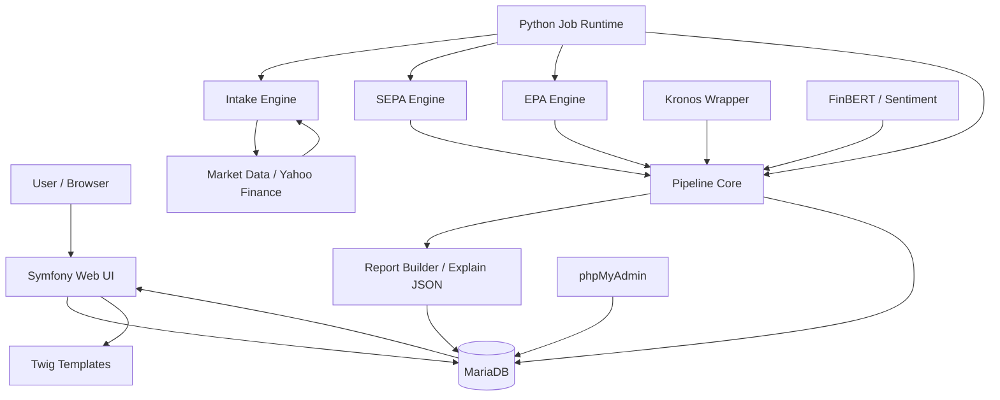
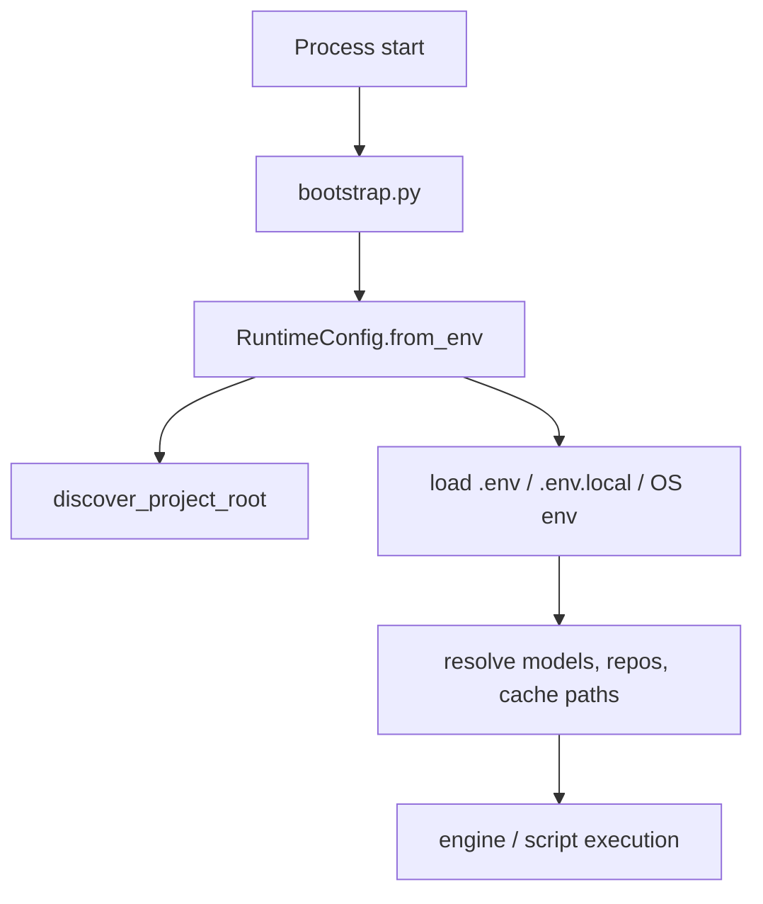
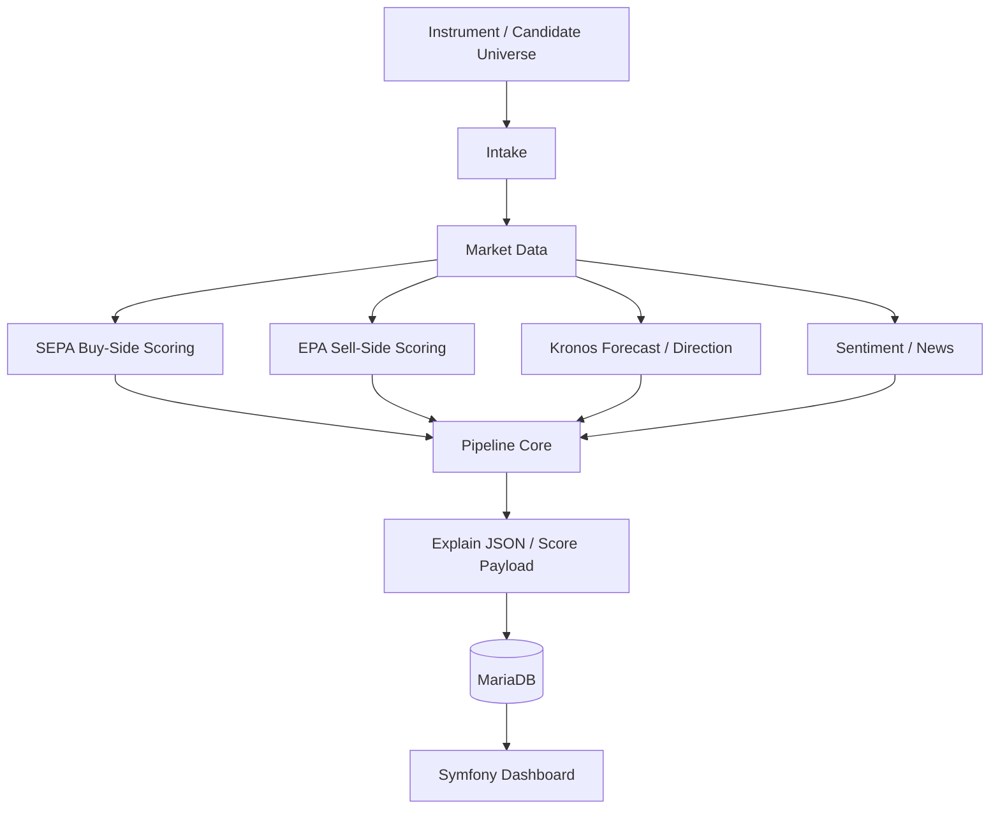
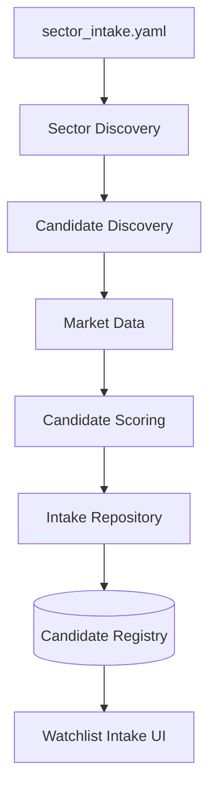
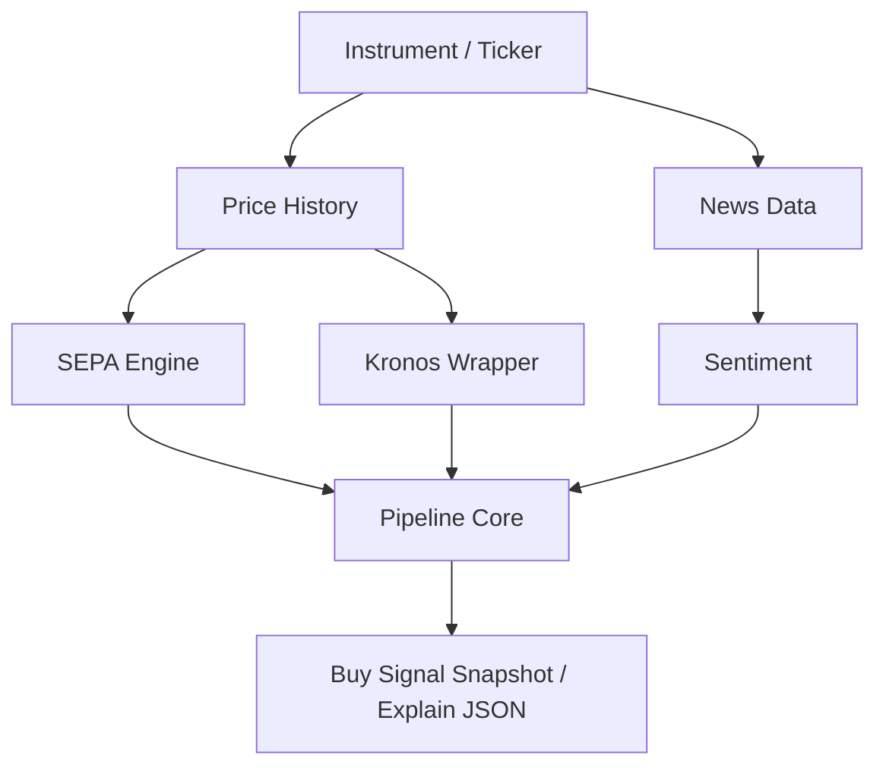
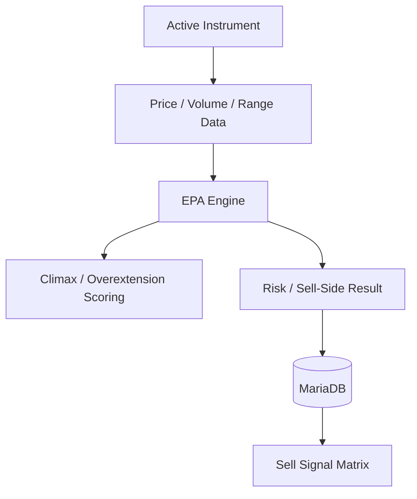
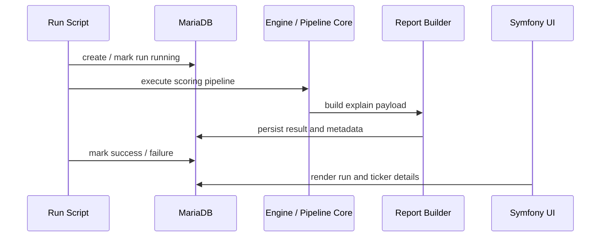

# Stock Project Wiki / Project Map

Generated from DeepWiki exports and manually normalized for repository use.

Status: curated architecture map, not executable specification.  
Source of truth: code, migrations, Compose files, and committed configuration.  
Recommended repository path: `docs/project-map/deepwiki.md`.

---

## Table of Contents

1. [Purpose](#purpose)
2. [Agent Usage Rules](#agent-usage-rules)
3. [System Overview](#system-overview)
4. [Repository Map](#repository-map)
5. [High-Level Architecture](#high-level-architecture)
6. [Runtime Configuration](#runtime-configuration)
7. [Data Flow](#data-flow)
8. [Intake and Candidate Registry](#intake-and-candidate-registry)
9. [Buy-Side: SEPA, Kronos and Sentiment](#buy-side-sepa-kronos-and-sentiment)
10. [Sell-Side: EPA](#sell-side-epa)
11. [Pipeline Runs and Reporting](#pipeline-runs-and-reporting)
12. [Database and Persistence](#database-and-persistence)
13. [Symfony Web UI](#symfony-web-ui)
14. [Docker and Infrastructure](#docker-and-infrastructure)
15. [phpMyAdmin](#phpmyadmin)
16. [Model and External Asset Integration](#model-and-external-asset-integration)
17. [Common Commands](#common-commands)
18. [Operational Guardrails](#operational-guardrails)
19. [Files Worth Reading First](#files-worth-reading-first)
20. [Maintenance Policy](#maintenance-policy)

---

## Purpose

This document is a compact map of the `stock-project` codebase. It is intended for humans and coding agents before making changes.

It answers:

- what the major subsystems are,
- where they live,
- how data flows through the project,
- which components are active runtime surfaces,
- which files should be read before changing a feature,
- how Docker, MariaDB, Symfony, Python jobs, SEPA/EPA/Kronos, and phpMyAdmin fit together.

It is deliberately **not** a replacement for source code. If this document and the code disagree, the code wins.

---

## Agent Usage Rules

Before changing code, an agent should:

1. Read this document.
2. Identify the affected subsystem.
3. Read the listed source files for that subsystem.
4. Change the minimum necessary set of files.
5. Preserve Docker/prod separation.
6. Preserve DB migrations and existing data assumptions.
7. Avoid touching model assets, local caches, `.env.local`, dumps, or generated runtime directories.
8. Treat generated documentation as lower authority than code, tests, migrations, and Compose files.

Do not infer active behavior from old docs if the implementation contradicts them.

---

## System Overview

`stock-project` is a local stock analytics system with two main layers:

| Layer | Stack | Role |
|---|---|---|
| Web UI | Symfony / PHP / Twig | Dashboards, instruments, watchlist intake, signal views, run views |
| Analytics backend | Python | Intake, market data, SEPA, EPA, Kronos, sentiment, reporting, DB writes |
| Persistence | MariaDB | Instruments, pipeline runs, snapshots, candidates, scores, explain data |
| Infrastructure | Docker Compose | MariaDB, web runtime, migration job, Python job runtime, phpMyAdmin |

The project is not a generic trading bot. It is a research, scoring, intake, and dashboard system. It produces structured views and snapshots that support decisions.

---

## Repository Map

Likely top-level layout:

```text
stock-project/
├── AGENTS.md
├── README.md
├── compose.yaml
├── docker/
│   ├── prod.env.example
│   ├── web/
│   ├── web-cli/
│   └── python-full/
├── docs/
│   └── project-map/
├── models/
│   └── README.md
├── repos/
│   └── README.md
├── stock-system/
│   ├── README.md
│   ├── config/
│   ├── scripts/
│   └── src/
└── web/
    ├── config/
    ├── migrations/
    ├── public/
    ├── src/
    └── templates/
```

Important distinction:

- `web/` is the Symfony application and Doctrine migration owner.
- `stock-system/` is the Python analytics and job runtime.
- `compose.yaml` is the current root Docker orchestration file.
- `models/` and `repos/` are external/local asset mount points, not code to be baked into images.

---

## High-Level Architecture



Core mechanism:

1. Python jobs fetch, normalize, score, and persist data.
2. MariaDB stores instruments, candidates, runs, snapshots, and explanations.
3. Symfony renders state from the DB.
4. Docker provides the runtime boundary.
5. phpMyAdmin is an admin surface for DB inspection.

---

## Runtime Configuration

The Python runtime is path-driven and environment-driven.

Key responsibilities:

- discover project root,
- load `.env` and `.env.local` where applicable,
- merge OS environment variables,
- resolve model directories,
- resolve Kronos and FinGPT repository paths,
- resolve cache directories,
- provide stable paths to scripts and engines.

Important files:

```text
stock-system/src/common/runtime_config.py
stock-system/src/common/config_loader.py
stock-system/scripts/bootstrap.py
stock-system/config/sector_intake.yaml
```

Conceptual flow:



Runtime paths should be configured through environment variables or Compose, not hard-coded Windows paths inside Python code.

---

## Data Flow

Primary end-to-end flow:



Data should remain auditable:

- raw/normalized inputs should be traceable,
- scores should carry breakdowns where possible,
- run status should be tracked,
- UI should present explainable payloads rather than opaque magic numbers.

---

## Intake and Candidate Registry

The intake subsystem discovers and qualifies new candidate stocks.

Main role:

```text
sector signal -> candidate discovery -> market enrichment -> scoring -> registry persistence -> manual review / downstream scoring
```

Important files:

```text
stock-system/src/intake/engine.py
stock-system/src/intake/candidate_discovery.py
stock-system/src/intake/sector_discovery.py
stock-system/src/intake/market.py
stock-system/src/intake/repository.py
stock-system/src/intake/candidates.py
stock-system/config/sector_intake.yaml
web/src/Controller/WatchlistIntakeController.php
web/src/Service/WatchlistIntakeViewBuilder.php
web/templates/watchlist_intake/index.html.twig
```

Conceptual flow:



Candidate discovery is not the same as purchase execution. The intake layer should produce candidates and context. It should not silently turn every candidate into a committed watchlist/instrument entry unless the UI/business rule explicitly requires it.

Useful config concepts:

| Config area | Meaning |
|---|---|
| sector proxies | sector ETFs / proxies for market context |
| `top_sectors` | number of sectors to consider |
| `candidates_per_sector` | number of candidates per selected sector |
| `cooldown_days` | prevents repeated resurfacing too soon |
| score thresholds | classify top / strong / research candidates |

---

## Buy-Side: SEPA, Kronos and Sentiment

The buy-side stack evaluates whether an active instrument or intake candidate has attractive setup characteristics.

Main buy-side signals:

| Signal | Role |
|---|---|
| SEPA | structural / technical setup and relative strength style scoring |
| Kronos | time-series forecast / directional model component |
| Sentiment / FinBERT | news and text sentiment context |
| Pipeline Core | combines component outputs into a merged score / decision payload |

Important files:

```text
stock-system/src/sepa/engine.py
stock-system/src/sepa/relative_strength.py
stock-system/src/pipeline/core.py
stock-system/src/kronos/wrapper.py
stock-system/src/sentiment/finbert_fallback.py
stock-system/src/data/news_data.py
stock-system/scripts/run_sepa.py
stock-system/scripts/run_pipeline.py
```

Conceptual flow:



When changing buy-side logic, inspect:

- score normalization,
- thresholds,
- DB write path,
- dashboard rendering,
- run output JSON,
- whether the change affects intake candidates, active instruments, or both.

---

## Sell-Side: EPA

EPA is the sell-side / risk-side analytics layer. It evaluates deterioration, overextension, climax-like behavior, and exit/risk context.

Important files:

```text
stock-system/src/epa/engine.py
stock-system/src/epa/climax.py
stock-system/scripts/run_epa.py
web/src/Controller/SellSignalMatrixController.php
```

Conceptual flow:



EPA should be treated separately from intake. Intake asks: “what should we research or consider?” EPA asks: “what risk/exit state exists for positions?”

---

## Pipeline Runs and Reporting

The pipeline layer coordinates multi-step analytics runs and persists their results.

Important files:

```text
stock-system/src/pipeline/core.py
stock-system/src/reporting/report_builder.py
stock-system/src/db/run_tracking.py
stock-system/src/db/adapters.py
stock-system/scripts/run_pipeline.py
stock-system/scripts/run_sepa.py
stock-system/scripts/run_epa.py
stock-system/scripts/run_watchlist_intake.py
web/src/Controller/DashboardController.php
web/src/Entity/PipelineRun.php
web/src/Entity/PipelineRunItem.php
web/src/Entity/PipelineRunItemNews.php
```

Run lifecycle:



Expected properties:

- scripts should produce machine-readable JSON where intended,
- warnings should not corrupt stdout JSON for machine callers,
- run status should be explicit,
- failures should explain missing data/assets instead of falling back silently.

---

## Database and Persistence

The database is MariaDB/MySQL. Doctrine migrations under `web/migrations` are the schema source for the Symfony side.

Important files:

```text
web/migrations/
web/src/Entity/
stock-system/src/db/connection.py
stock-system/src/db/adapters.py
stock-system/src/db/run_tracking.py
```

Core entity/table areas:

| Area | Typical purpose |
|---|---|
| `instrument` | tracked tickers / active instruments |
| `pipeline_run` | execution metadata |
| `pipeline_run_item` | per-run, per-instrument result |
| `pipeline_run_item_news` | news rows associated with run items |
| SEPA snapshot tables | buy-side setup state |
| EPA snapshot tables | sell-side risk state |
| intake candidate tables | sector/candidate discovery and registry |

Database connection configuration should come from:

- `DATABASE_URL`, or
- individual `DB_HOST`, `DB_PORT`, `DB_NAME`, `DB_USER`, `DB_PASSWORD`, or
- Docker Compose environment variables.

Do not hard-code host database credentials in source files.

---

## Symfony Web UI

The Symfony web app renders the current database state and provides user-facing workflows.

Important files:

```text
web/src/Controller/DashboardController.php
web/src/Controller/InstrumentController.php
web/src/Controller/SignalMatrixController.php
web/src/Controller/SellSignalMatrixController.php
web/src/Controller/WatchlistIntakeController.php
web/src/Service/WatchlistIntakeViewBuilder.php
web/src/Service/RunImportService.php
web/templates/
web/config/
```

Key UI surfaces:

| UI area | Role |
|---|---|
| Dashboard | summary and run/ticker views |
| Instrument UI | create/manage instruments |
| Signal Matrix | buy-side signal matrix |
| Sell Signal Matrix | sell-side / EPA matrix |
| Watchlist Intake | review and manually accept/reject candidates |
| Run views | inspect imported/executed pipeline runs |

The web runtime should read from the DB and render explainable payloads. In Docker mode, Windows-native launcher assumptions should not be used unless explicitly made container-safe.

---

## Docker and Infrastructure

Root `compose.yaml` is the main orchestration file.

Main services:

| Service | Role |
|---|---|
| `db` | MariaDB 10.11 database |
| `migrate` | one-shot Symfony/Doctrine migration runner |
| `web` | Symfony web UI |
| `job` | Python analytics job runtime |
| `phpmyadmin` | browser-based DB admin UI |

Core Compose mechanics:

- `db` owns the MariaDB volume.
- `migrate` waits for healthy DB and applies migrations.
- `web` waits for healthy DB and exposes the UI port.
- `job` runs one-shot analytics commands.
- `phpmyadmin` connects to the Compose service name `db`.

Do not bake local model assets into images. Mount them.

---

## phpMyAdmin

phpMyAdmin is intended as a convenience admin UI for the Docker MariaDB service.

Service behavior:

```text
phpMyAdmin -> db:3306
host browser -> localhost:${STOCK_PHPMYADMIN_PORT:-8081}
```

Production-style startup:

```bash
docker compose --env-file docker/prod.env -p stock-project-prod up -d phpmyadmin
```

Open:

```text
http://localhost:8081
```

If port `8081` is occupied, set in `docker/prod.env`:

```dotenv
STOCK_PHPMYADMIN_PORT=8082
```

Then restart phpMyAdmin:

```bash
docker compose --env-file docker/prod.env -p stock-project-prod up -d phpmyadmin
```

Login credentials come from the same DB variables used by Compose:

```dotenv
STOCK_DB_NAME=stock_project
STOCK_DB_USER=stock_app
STOCK_DB_PASSWORD=...
STOCK_DB_ROOT_PASSWORD=...
```

Use phpMyAdmin for inspection and targeted manual checks. Do not use it as an uncontrolled migration mechanism.

---

## Model and External Asset Integration

The full pipeline depends on local assets that should remain external to Git and Docker images.

Expected asset classes:

```text
models/
repos/Kronos/
repos/FinGPT/
```

Container paths:

```text
/app/models
/app/repos/Kronos
/app/repos/FinGPT
```

Typical env variables:

```dotenv
STOCK_MODELS_DIR=E:/stock-project/models
STOCK_KRONOS_DIR=E:/stock-project/repos/Kronos
STOCK_FINGPT_DIR=E:/stock-project/repos/FinGPT
```

Runtime variables inside the container should resolve to Linux paths:

```dotenv
PROJECT_ROOT=/app
MODELS_DIR=/app/models
KRONOS_DIR=/app/repos/Kronos
FINGPT_DIR=/app/repos/FinGPT
HF_HOME=/app/.hf-cache
YFINANCE_CACHE_DIR=/app/var/cache/yfinance
```

If a model or external repo is missing, the system should fail clearly with a path/asset error. Silent fallback to random host paths is incorrect.

---

## Common Commands

### Start DB

```bash
docker compose up -d db
```

### Run migrations

```bash
docker compose --profile setup run --rm migrate
```

### Start web UI

```bash
docker compose up -d web
```

Open:

```text
http://127.0.0.1:8000/
```

### Run default intake job

```bash
docker compose --profile jobs run --rm job intake
```

### Run SEPA

```bash
docker compose --profile jobs run --rm job sepa
```

### Run EPA

```bash
docker compose --profile jobs run --rm job epa
```

### Run full pipeline

```bash
docker compose --profile jobs run --rm job pipeline
```

### Production project commands

```bash
docker compose --env-file docker/prod.env -p stock-project-prod up -d db web
```

```bash
docker compose --env-file docker/prod.env -p stock-project-prod --profile jobs run --rm job intake
```

```bash
docker compose --env-file docker/prod.env -p stock-project-prod up -d phpmyadmin
```

---

## Operational Guardrails

### Code and docs

- Keep generated wiki/docs separate from source-of-truth code.
- Prefer `docs/project-map/deepwiki.md` for generated/curated architecture maps.
- Do not delete operational runbooks unless intentionally obsolete.
- If generated docs mention local temp paths, remove them before commit.

### Docker

- Do not conflate dev and prod Compose projects.
- Use `-p stock-project-prod` for prod-like local runtime.
- Use `docker/prod.env` for prod runtime values.
- Do not commit `docker/prod.env`.
- Do not bake models, dumps, or external repos into images.

### Database

- Migrations belong under `web/migrations`.
- Use logical SQL dumps for DB migration/recovery, not raw MariaDB data directories.
- phpMyAdmin is for inspection/manual admin, not a substitute for migrations.

### Analytics

- Intake, SEPA, EPA, Kronos, and Sentiment have separate purposes.
- Do not collapse buy-side and sell-side logic into one opaque score without preserving explanations.
- Persist enough explain data for dashboard/audit views.

### Agents

- Read relevant controller/service/template/entity/script files before editing.
- Do not infer behavior from names alone.
- If an entrypoint is Docker-only or Windows-native, preserve that distinction.
- Minimize file changes.

---

## Files Worth Reading First

### For phpMyAdmin / Docker

```text
compose.yaml
docker/prod.env.example
docker/web/Dockerfile
docker/web-cli/Dockerfile
docker/python-full/Dockerfile
```

### For Watchlist Intake

```text
stock-system/src/intake/engine.py
stock-system/src/intake/candidate_discovery.py
stock-system/src/intake/sector_discovery.py
stock-system/src/intake/repository.py
stock-system/config/sector_intake.yaml
web/src/Controller/WatchlistIntakeController.php
web/src/Service/WatchlistIntakeViewBuilder.php
web/templates/watchlist_intake/index.html.twig
```

### For buy-side signals

```text
stock-system/src/sepa/engine.py
stock-system/src/sepa/relative_strength.py
stock-system/src/kronos/wrapper.py
stock-system/src/sentiment/finbert_fallback.py
stock-system/src/pipeline/core.py
stock-system/scripts/run_sepa.py
stock-system/scripts/run_pipeline.py
```

### For sell-side signals

```text
stock-system/src/epa/engine.py
stock-system/src/epa/climax.py
stock-system/scripts/run_epa.py
web/src/Controller/SellSignalMatrixController.php
```

### For dashboard and run views

```text
web/src/Controller/DashboardController.php
web/src/Controller/SignalMatrixController.php
web/src/Controller/SellSignalMatrixController.php
web/templates/dashboard/
web/templates/instrument/
web/src/Entity/PipelineRun.php
web/src/Entity/PipelineRunItem.php
web/src/Entity/PipelineRunItemNews.php
```

### For DB persistence

```text
web/migrations/
web/src/Entity/
stock-system/src/db/connection.py
stock-system/src/db/adapters.py
stock-system/src/db/run_tracking.py
```

---

## Maintenance Policy

Update this document when any of the following change:

- a new job entrypoint is added,
- database schema changes materially,
- Compose service names or ports change,
- intake flow changes,
- SEPA/EPA/Kronos/sentiment weighting changes,
- web launch behavior changes,
- model asset paths or mount strategy changes,
- phpMyAdmin/admin tooling changes.

Recommended update process:

```text
1. Generate raw DeepWiki or repo-summary output from a clean tracked-code snapshot.
2. Do not commit raw export directly.
3. Remove local paths and generated noise.
4. Keep only operationally useful architecture, commands, and file maps.
5. Review against actual code and Compose files.
6. Commit as docs/project-map/deepwiki.md.
```

---

## One-Sentence Summary

`stock-project` is a Docker-capable local stock analytics system where Python jobs generate intake, buy-side, sell-side, model, and sentiment results into MariaDB, while Symfony renders the decision surfaces and phpMyAdmin provides direct DB inspection for local operations.
