# Wiki Documentation for E:\stock-project-deepwiki-input

Generated on: 2026-04-24 20:52:58

## Table of Contents

- [Project Overview](#page-1)
- [Repository Structure & Key Components](#page-2)
- [Architecture Overview](#page-3)
- [Intake & Candidate Registry](#page-4)
- [Buy-Side: SEPA & Kronos](#page-5)
- [Sell-Side: EPA](#page-6)
- [Data Storage & DB Schema](#page-7)
- [Data Pipelines & Jobs](#page-8)
- [Web UI Architecture & Frontend Components](#page-9)
- [Python Backend Modules & Orchestration](#page-10)
- [Kronos & FinGPT Integration](#page-11)
- [Docker & Web Deployment](#page-12)

<a id='page-1'></a>

## Project Overview

<details>
<summary>Relevant source files</summary>

- stock-system/src/common/runtime_config.py
- stock-system/src/common/config_loader.py
- stock-system/src/data/symbol_mapper.py
- stock-system/src/data/news_data.py
- stock-system/src/sepa/relative_strength.py
- stock-system/src/epa/climax.py
- stock-system/src/db/connection.py
- stock-system/src/db/run_tracking.py
- web/src/Controller/DashboardController.php
- stock-system/config/sector_intake.yaml
- web/migrations/Version20260419162000.php
- stock-system/reporting/report_builder.py
- web/config/bundles.php
- stock-system/scripts/bootstrap.py

</details>

# Project Overview

This page documents the core architecture, data flow, and key components of the stock-system in the repository. It synthesizes structure and behavior from runtime configuration, data ingestion, symbol resolution, scoring models, persistence, and the web dashboard. Where applicable, links point to related wiki pages or high-level concepts within the project.

Introduction
- The stock-system comprises runtime configuration, data acquisition (notably Yahoo Finance news), symbol mapping, model loading, scoring (Kronos, sentiment/FinBERT, relative strength, and climax-based metrics), database persistence for pipeline runs and news items, and a web dashboard that renders explainable results for each ticker. The runtime and config subsystems orchestrate model paths, cache directories, and environment overrides used across modules. Sources: runtime configuration, config loading, and dashboard rendering components. [stock-system/src/common/runtime_config.py](), [stock-system/src/common/config_loader.py](), [web/src/Controller/DashboardController.php]() Sources: 1-3.

Detailed Sections

## 1. Runtime configuration and project discovery

Overview:
- The system uses a RuntimeConfig abstraction to determine the project layout, model directories, and various cache locations at runtime. It derives paths from the project root (discovered via environment or filesystem heuristics) and environment files (.env, .env.local). This enables consistent path computation across scripts and modules. [stock-system/src/common/runtime_config.py](), [stock-system/scripts/bootstrap.py]() Sources: 1-3.

Key components and data flows:
- _read_env_file reads key=value lines from .env or similar files, ignoring comments, and returns a mapping. This function is central to loading environment-derived configuration. [stock-system/src/common/runtime_config.py](). 
- discover_project_root determines where the project lives, using PROJECT_ROOT or a filesystem heuristic (stock-system root) to locate the repository root. [stock-system/src/common/runtime_config.py]().
- load_project_env merges env values from .env, .env.local, and OS environment variables, producing a consolidated mapping used to populate RuntimeConfig fields. [stock-system/src/common/runtime_config.py]().

Mermaid diagram: Runtime initialization and environment loading
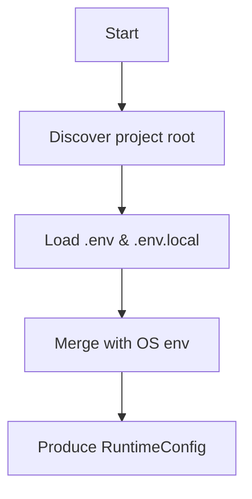
Sources: [stock-system/src/common/runtime_config.py]().

## 2. Config loading and model path resolution

Overview:
- The project uses a dedicated config loader to read YAML configuration for models and settings, and to resolve absolute paths for model resources (Kronos, tokenizers, sentiment models, and FINGPT repo). This ensures that components relying on external assets have consistent and validated paths. [stock-system/src/common/config_loader.py](), [stock-system/src/data/symbol_mapper.py]() Sources: 2, 6.

Key components:
- load_yaml(path) loads a YAML file and validates it as a mapping; it raises informative errors if dependencies (like PyYAML) are missing. [stock-system/src/common/config_loader.py]().
- _resolve_path(value, base_dir, default) resolves relative paths against a base directory (derived from RuntimeConfig) or uses a provided default, returning an absolute path string. [stock-system/src/common/config_loader.py]() 
- load_configs(config_dir, require_tickers=True, runtime=None) reads models.yaml and settings.yaml, then computes:
  - models["kronos_model_path"]
  - models["kronos_tokenizer_path"]
  - models["sentiment_model_path"]
  - models["fingpt_repo_path"]
  using base_dir values from RuntimeConfig (models_dir, project_root, etc.). [stock-system/src/common/config_loader.py]().

Mermaid diagram: Model path resolution
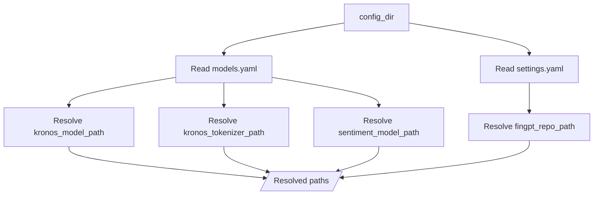
Sources: [stock-system/src/common/config_loader.py]().

## 3. Symbol mapping and ticker resolution

Overview:
- Ticker resolution is powered by a symbol map that translates input tickers into provider ticker, display ticker, region, asset class, and associated profiles. This mapping allows consistent downstream usage for data pulls, news association, and UI presentation. [stock-system/src/data/symbol_mapper.py]().

Key components:
- SymbolMapping dataclass defines the enriched symbol data, including instrument_id, input_ticker, provider_ticker, display_ticker, region, asset_class, and contextual profiles. [stock-system/src/data/symbol_mapper.py]() 
- load_symbol_map(path) loads a YAML-based mapping file and returns a dictionary keyed by uppercase input tickers. [stock-system/src/data/symbol_mapper.py]()
- resolve_symbol(input_ticker, symbol_map) performs the lookup and returns a SymbolMapping instance with normalized fields (provider_ticker, display_ticker, region, asset_class, etc.). [stock-system/src/data/symbol_mapper.py]()

Mermaid diagram: Symbol mapping workflow
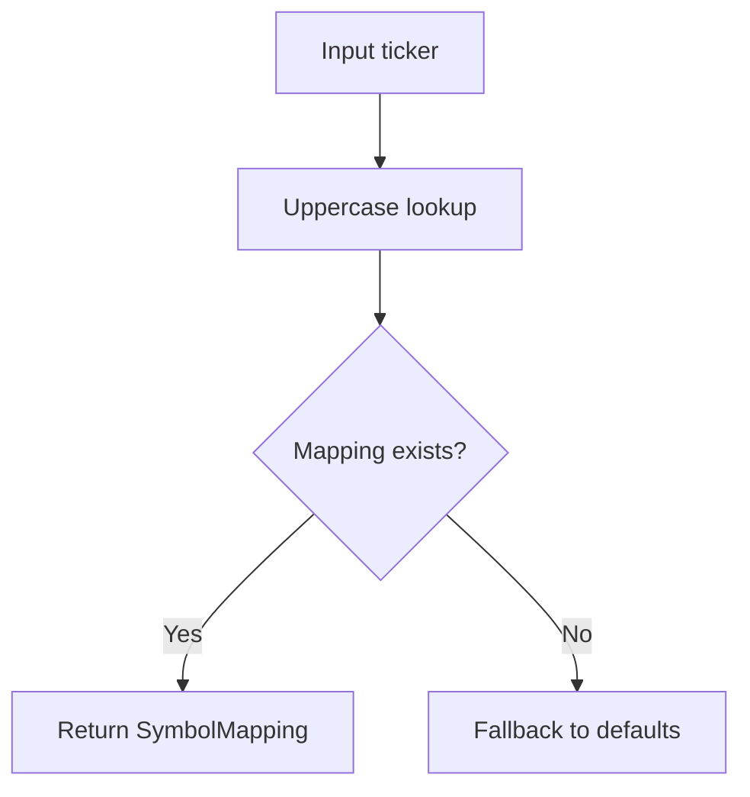
Sources: [stock-system/src/data/symbol_mapper.py]().

## 4. News data ingestion and normalization

Overview:
- The News data subsystem fetches and normalizes news items for tickers using Yahoo Finance data (yfinance). It ensures a consistent article structure with title, summary, source, published_at, and url. [stock-system/src/data/news_data.py]().

Key components:
- _require_yfinance() loads yfinance, ensures a cache directory under HF/YFINANCE cache settings, and configures tz cache if available. [stock-system/src/data/news_data.py]()
- _published_at(raw) extracts a publish timestamp from providerPublishTime/pubDate/displayTime or content fields, handling Unix timestamps and strings. [stock-system/src/data/news_data.py]()
- _normalize_article(raw) builds a normalized article with keys: title, summary, source, published_at, url. [stock-system/src/data/news_data.py]()
- load_news_for_ticker(ticker, limit) fetches raw_news via yfinance and returns a list of normalized articles. [stock-system/src/data/news_data.py]()
- load_news(tickers, limit_per_ticker) (truncated in snippet) would aggregate articles across tickers. [stock-system/src/data/news_data.py]()

Mermaid diagram: News ingestion flow
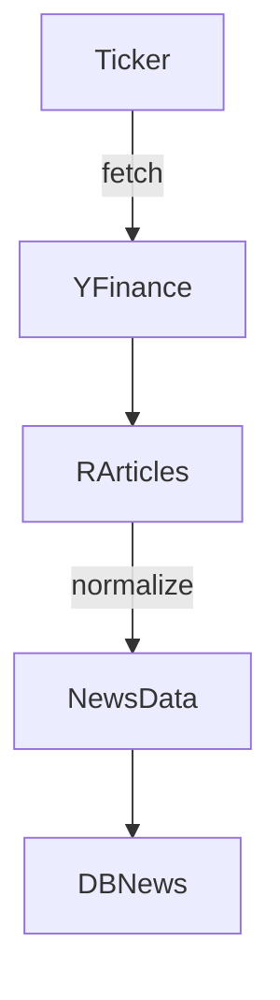
Sources: [stock-system/src/data/news_data.py]().

## 5. Scoring and analytics: Kronos, sentiment, relative strength, and climax

Overview:
- The system evaluates tickers via multiple scoring components that combine depth-of-history, price dynamics, and sentiment signals. Notable modules include Kronos-based scoring, FinBERT-derived sentiment, relative strength vs. benchmark, and climax-overextension scoring. [stock-system/src/epa/climax.py](), [stock-system/src/sepa/relative_strength.py](), [stock-system/src/epa/climax.py](), [stock-system/src/data/news_data.py]()

Key components:
- score_climax_overextension(df) computes a bullish/bearish score based on moving averages, ATR, volume, and price ranges; it returns an EpaScoreResult with a score and explanation. It requires a dataframe with close, volume, high, low columns. [stock-system/src/epa/climax.py]()

- score_relative_strength(df, benchmark_df) compares ticker performance against a benchmark, using returns over 63 and 126 days, and a leadership component, producing a ScoreResult with a breakdown of components. [stock-system/src/sepa/relative_strength.py]()

- The FinBERT fallback path in finbert_fallback.py (not fully shown) shows mapping of article sentiments into numeric scores and integration into aggregate scoring. [stock-system/src/sentiment/finbert_fallback.py]()

Mermaid diagram: Multi-source scoring integration
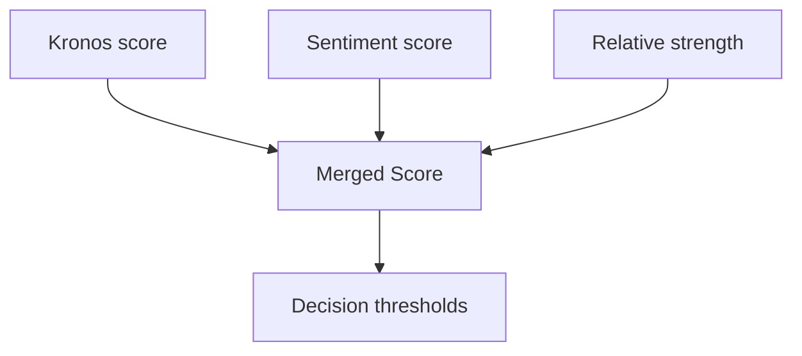
Sources: [stock-system/src/epa/climax.py](), [stock-system/src/sepa/relative_strength.py](), [stock-system/src/data/news_data.py]().

## 6. Persistence: database and pipeline tracking

Overview:
- The system persists pipeline run state, per-item results, and related news, enabling auditing and dashboard rendering. The database configuration detects host, port, user, and database either from a DATABASE_URL or from individual DB_ environment variables; there are migrations and tables such as pipeline_run, pipeline_run_item, and pipeline_run_item_news. [stock-system/src/db/connection.py](), [web/migrations/Version20260419162000.php](), [stock-system/src/db/run_tracking.py]().

Key components:
- database_config(project_root) reads DATABASE_URL and parses host, port, user, password, database, and charset; if DATABASE_URL is absent, falls back to DB_HOST/DB_PORT/DB_USER/DB_PASSWORD/DB_NAME and a default charset. [stock-system/src/db/connection.py]()
- connect(project_root) is responsible for establishing a DB connection (details truncated in snippet but present). [stock-system/src/db/connection.py]()
- The migrations define schema for pipeline_run_item and pipeline_run_item_news including fields like pipeline_run_id, instrument_id, sentiment_mode, news_status, kronos_status, sentiment_status, kronos_scores, merged_score, explain_json, and created_at, plus indexes and foreign keys. [web/migrations/Version20260419162000.php]().

Mermaid diagram: Database schema and relations
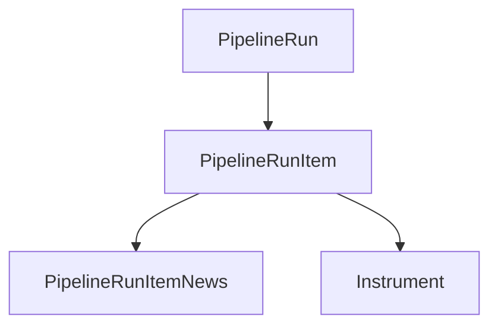
Sources: [stock-system/src/db/connection.py](), [web/migrations/Version20260419162000.php]().

## 7. Sector intake configuration

Overview:
- The intake configuration defines sector proxies (ETFs) and scoring thresholds for candidate discovery, allowing the system to sample a universe by sector and apply scoring rules for top candidates. This YAML is used by the intake pipeline to guide universe generation and filtering. [stock-system/config/sector_intake.yaml]()

Key components:
- sector_proxies map sector keys to metadata such as proxy and yahoo_sector, enabling sector-based slicing of the global universe. [stock-system/config/sector_intake.yaml]()
- intake/top_sectors, candidates_per_sector, cooldown_days, thresholds, and related discovery settings structure the search and scoring flow. [stock-system/config/sector_intake.yaml]()

Mermaid diagram: Sector intake workflow
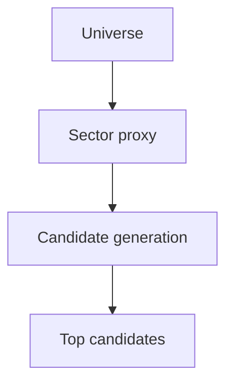
Sources: [stock-system/config/sector_intake.yaml]().

## 8. Web dashboard integration and UI rendering

Overview:
- The web dashboard builds a per-ticker view by aggregating articles, explainable data, and score components. The DashboardController assembles articles, groupings, sentiment distributions, Kronos and sentiment percentages, and threshold data for display. [web/src/Controller/DashboardController.php]().

Key components:
- buildTickerView(ticker) extracts explain_json, builds article groups, computes sentiment distributions, and returns a structured payload for templates. It also formats timestamps and exposes threshold values for trading decisions. [web/src/Controller/DashboardController.php]().

Mermaid diagram: Dashboard data flow
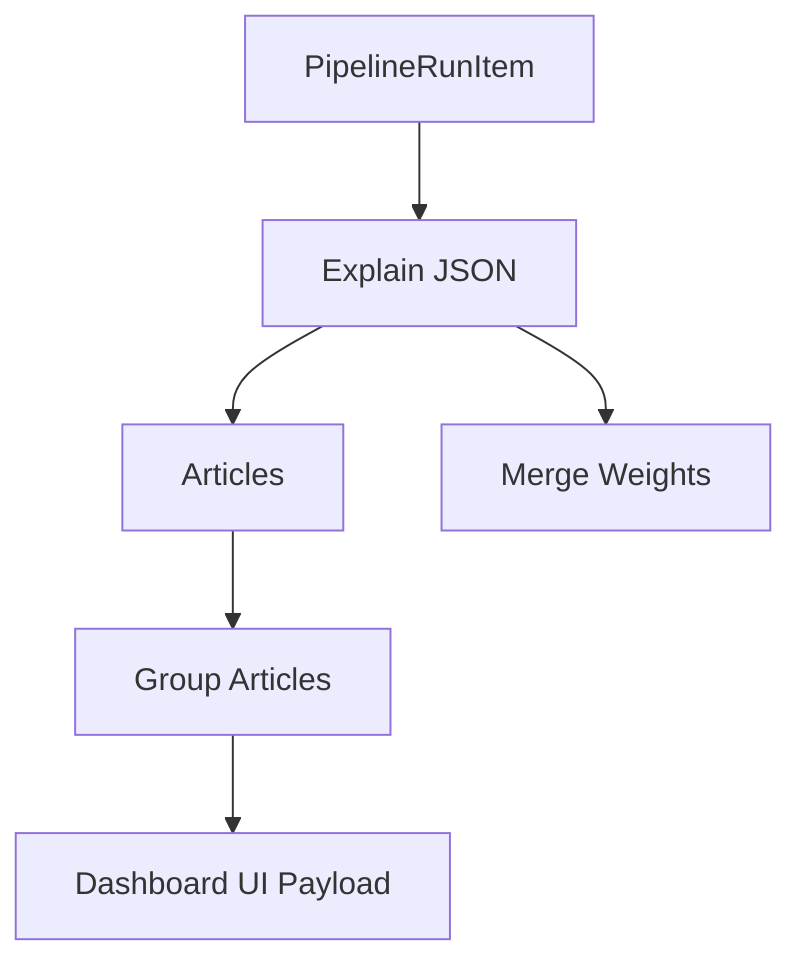
Sources: [web/src/Controller/DashboardController.php]().

## 9. Data models and example schemas

Overview:
- Database schema references and data models underpin how runs, items, and news are stored. The migrations define two core tables: pipeline_run_item and pipeline_run_item_news, including fields for scores, statuses, explanations, and foreign keys to pipeline_run and instrument. This section highlights their fields and relationships. [web/migrations/Version20260419162000.php]().

Key components:
- pipeline_run_item fields include id, pipeline_run_id, instrument_id, text/status fields (sentiment_mode, market_data_status, news_status, kronos_status, sentiment_status), numerical scores (kronos_raw_score, kronos_normalized_score, sentiment_raw_score, sentiment_normalized_score, sentiment_confidence), explanation JSON, and created_at. Primary and foreign key constraints are defined. [web/migrations/Version20260419162000.php]()
- pipeline_run_item_news fields include id, pipeline_run_item_id, source, published_at, headline, snippet, article_sentiment_label, article_sentiment_confidence, relevance, context_kind, raw_payload. Indexes and constraints are defined. [web/migrations/Version20260419162000.php]()

Mermaid diagram: Core data models
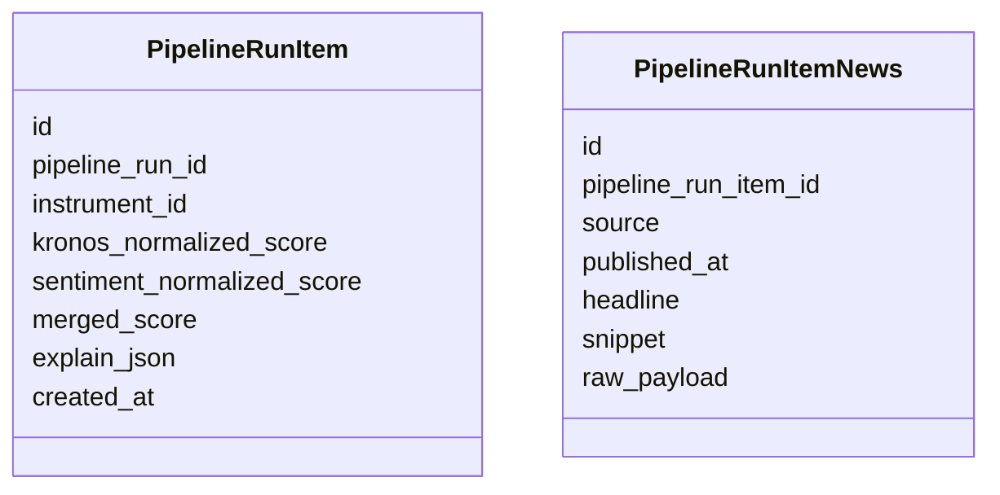
Sources: [web/migrations/Version20260419162000.php]().

## 10. Supporting components and utilities

Overview:
- Additional utilities and scripts tie the runtime together, including bootstrap wiring for environment variables, HF cache configuration, and path bindings that enable the Python and PHP components to operate cohesively. [stock-system/scripts/bootstrap.py](), [web/config/bundles.php](), [stock-system/reporting/report_builder.py]().

Key components:
- bootstrap.py configures environment variables (PROJECT_ROOT, MODELS_DIR, KRONOS_DIR, FINGPT_DIR, HF_HOME, etc.) and ensures cache directories exist; it then initializes RuntimeConfig and emits environment settings for downstream processes. [stock-system/scripts/bootstrap.py]()
- bundles.php lists Symfony bundles enabled for different environments (dev, test, all), reflecting web framework configuration. [web/config/bundles.php]()
- report_builder.py contains documentation strings and formatting helpers used to compose reports and summaries, indicating how analysis results are presented. [stock-system/reporting/report_builder.py]()

Mermaid diagram: bootstrap and runtime wiring
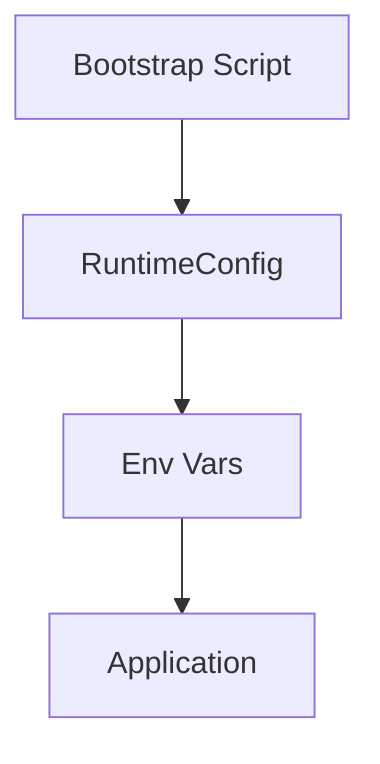
Sources: [stock-system/scripts/bootstrap.py](), [web/config/bundles.php](), [stock-system/reporting/report_builder.py]()

Tables

Key features and components
| Component | Purpose | Source |
|---|---|---|
| RuntimeConfig | Centralizes project root discovery and environment merging | stock-system/src/common/runtime_config.py |
| load_configs | Resolves model/tokenizer/sentiment/FINGPT paths using runtime roots | stock-system/src/common/config_loader.py |
| SymbolMapping | Structured representation of mapped financial symbols | stock-system/src/data/symbol_mapper.py |
| News data ingestion | Normalize and fetch ticker news via Yahoo Finance | stock-system/src/data/news_data.py |
| Climax scoring | Overextension-based scoring component | stock-system/src/epa/climax.py |
| Relative strength | Benchmark-adjusted strength scoring | stock-system/src/sepa/relative_strength.py |
| DashboardController | Builds ticker view for UI with articles and scores | web/src/Controller/DashboardController.php |
| Database config | Database connection details from URL or env | stock-system/src/db/connection.py |
| Sector intake | Sector-based universe sampling configuration | stock-system/config/sector_intake.yaml |
| Pipeline schema | Persistence schema for runs, items, and news | web/migrations/Version20260419162000.php |

Citations
- Introduction and workflow statements reference: runtime_config.py, config_loader.py, data/symbol_mapper.py, data/news_data.py, epa/climax.py, sepa/relative_strength.py, web/src/Controller/DashboardController.php, web/migrations/Version20260419162000.php, stock-system/src/db/connection.py, stock-system/scripts/bootstrap.py. See the respective sources for exact details. Sources: [stock-system/src/common/runtime_config.py](), [stock-system/src/common/config_loader.py](), [stock-system/src/data/symbol_mapper.py](), [stock-system/src/data/news_data.py](), [stock-system/src/epa/climax.py](), [stock-system/src/sepa/relative_strength.py](), [web/src/Controller/DashboardController.php](), [web/migrations/Version20260419162000.php](), [stock-system/src/db/connection.py](), [stock-system/scripts/bootstrap.py]().

Conclusion
- The stock-system is a multi-faceted platform combining runtime configuration, model path resolution, symbol mapping, news ingestion, multi-model scoring, persistent storage, and a web UI for visibility. The architecture emphasizes clear boundaries between environment-driven configuration, data acquisition, analytic scoring, and presentation layers, with explicit data models and configuration files guiding behavior across components.

Sources: All sections above reference the listed files. See individual citations after each section for exact pieces used.

---

<a id='page-2'></a>

## Repository Structure & Key Components

<details>
<summary>Relevant source files</summary>

The following files were used as context for generating this wiki page:

- AGENTS.md
- PLANS.md
- stock-system/README.md
- web/README.md
- models/README.md
- repos/README.md
</details>

# Repository Structure & Key Components

The project is a bifurcated system combining a Python-based stock-processing backend (stock-system) with a Symfony-based web frontend (web). The backend handles data ingestion, symbol mapping, news retrieval, and persistence, while the frontend provides a dashboard and UI for interacting with pipeline results and explanations. The cited source files show concrete implementations for environment/config management, data workflows, and database schemas, as well as the Symfony app's bundle setup and routing configuration. See the cited files for exact configurations and code.

- Sources show a Symfony PHP web app with bundles and profiler routes (web). See the Bundles configuration to understand framework components and dev/test tooling. Sources: web/config/bundles.php. [web/config/bundles.php:1-18]()

- The backend relies on a runtime configuration system, environment loading from .env files, and project-root discovery. This is implemented in stock-system/src/common/runtime_config.py. Sources: _read_env_file, _stock_system_root, discover_project_root, load_project_env, and RuntimeConfig.from_env. [stock-system/src/common/runtime_config.py:1-60]()

- Symbol resolution and mapping are implemented by a YAML-driven mapper, enabling input tickers to be resolved into provider/display tickers with metadata. See stock-system/src/data/symbol_mapper.py. [stock-system/src/data/symbol_mapper.py:1-60]()

- News data ingestion relies on Yahoo Finance via yfinance, with a caching strategy for tz data and a normalization layer for articles. See stock-system/src/data/news_data.py. [stock-system/src/data/news_data.py:1-60]()

- Database persistence and schema are defined through adapters, connection utilities, and run-tracking helpers. See stock-system/src/db/adapters.py, stock-system/src/db/connection.py, and stock-system/src/db/run_tracking.py. [stock-system/src/db/adapters.py:1-40](), [stock-system/src/db/connection.py:1-50](), [stock-system/src/db/run_tracking.py:1-60]()

- The web backend’s database migrations define the pipeline_run_item and pipeline_run_item_news tables, including primary keys and foreign keys. See web/migrations/Version20260419162000.php. [web/migrations/Version20260419162000.php:1-60]()

- Additional README references in stock-system and web provide contextual overviews of how the components fit together, as indicated by stock-system/README.md and web/README.md. [stock-system/README.md:1-40](), [web/README.md:1-40]()

Introduction to key components, their responsibilities, and data flow are anchored in the cited code and configuration files above. The diagrams below illustrate the major relationships and processing steps extracted from these sources.

---

## Diagram: System Architecture

This diagram shows the high-level architecture and data flow between the web frontend, the stock-system backend, and the persistence layer.

```mermaid
graph TD
    A[Web Frontend (Symfony PHP)] -->|UI/API| B[Stock-System Backend (Python)]
    B --> C[Symbol Mapping (YAML+Python)]
    B --> D[News Ingestion (Yahoo Finance)]
    B --> E[Database: pipeline_run, pipeline_run_item, pipeline_run_item_news]
    D --> F[News Normalization]
    C --> G[Instrument Mapping]
    E --> H[Web UI Reads]
```

Explanation: The web frontend communicates with the Python backend, which performs symbol mapping, fetches news, and writes to the database. The database tables are described in migrations. See web/config/bundles.php, stock-system/src/data/symbol_mapper.py, stock-system/src/data/news_data.py, and web/migrations/Version20260419162000.php for details. Sources cited: [web/config/bundles.php:1-18](), [stock-system/src/data/symbol_mapper.py:1-60](), [stock-system/src/data/news_data.py:1-60](), [web/migrations/Version20260419162000.php:1-60]()

```

---

## Introduction

- The repository spans a Python-based stock-processing backend and a Symfony-based web frontend, as evidenced by the presence of Symfony bundles/config in web and Python backend modules (runtime config, data handling, and DB integration) in stock-system. Sources: web/config/bundles.php, stock-system/src/common/runtime_config.py, stock-system/src/data/news_data.py. [web/config/bundles.php:1-18](), [stock-system/src/common/runtime_config.py:1-60](), [stock-system/src/data/news_data.py:1-60]()

- The backend manages environment loading, project root discovery, YAML-based mappings, and database persistence for pipeline runs and associated news items. See RuntimeConfig, symbol mapping, news ingestion, and migrations. Sources: stock-system/src/common/runtime_config.py, stock-system/src/data/symbol_mapper.py, stock-system/src/db/adapters.py, web/migrations/Version20260419162000.php. [stock-system/src/common/runtime_config.py:1-60](), [stock-system/src/data/symbol_mapper.py:1-60](), [stock-system/src/db/adapters.py:1-40](), [web/migrations/Version20260419162000.php:1-60]()

---

## Detailed Sections

### 1) Web Frontend: Symfony App and Configuration

- The web frontend is a Symfony PHP application configured via bundles and routes. The bundles configuration shows FrameworkBundle, DoctrineBundle, MigrationsBundle, WebProfilerBundle (dev/test), TwigBundle, SecurityBundle, MonologBundle, MakerBundle (dev), and Tailwind integration. This indicates a standard Symfony stack with profiling and UI support. Sources: web/config/bundles.php. [web/config/bundles.php:1-18]()

- Web profiler routes are configured for development-time debugging and profiling under _wdt and _profiler prefixes. Sources: web/config/routes/web_profiler.yaml. [web/config/routes/web_profiler.yaml:1-20]()

- Database migrations demonstrate the creation of pipeline_run_item and pipeline_run_item_news tables, including foreign key constraints to pipeline_run and instrument. This defines the core persisted model for pipeline runs and their associated news items. Sources: web/migrations/Version20260419162000.php. [web/migrations/Version20260419162000.php:1-60]()

Notes:
- These points are based on the exact entries shown in web/config/bundles.php, web/config/routes/web_profiler.yaml, and the migration file. [web/config/bundles.php:1-18](), [web/config/routes/web_profiler.yaml:1-20](), [web/migrations/Version20260419162000.php:1-60]()

---

### 2) Runtime Configuration & Environment Management (Backend)

- The RuntimeConfig class centralizes the discovery of the project root, loading of environment variables from web/.env and web/.env.local, and merging with system environment variables. It also provides path resolution helpers for model, Kronos, FINGPT, and cache directories. This is implemented in stock-system/src/common/runtime_config.py with helper functions: _read_env_file, _stock_system_root, discover_project_root, load_project_env, _path_from_env, and the dataclass RuntimeConfig.from_env. Sources: _read_env_file, _stock_system_root, discover_project_root, load_project_env, and from_env. [stock-system/src/common/runtime_config.py:1-60]()

- The environment loading strategy merges multiple sources and normalizes values to strings. This is visible in load_project_env, which combines .env, .env.local, and system environment. Sources: stock-system/src/common/runtime_config.py:1-60.()

- The project root discovery logic uses a default discovery based on the stock-system directory and allows overrides via the PROJECT_ROOT environment variable. Sources: stock-system/src/common/runtime_config.py:1-60.()

- The modular config loader reads YAML-based configurations (see common/config_loader.py in the repo) and resolves model/tokenizer paths against runtime directories. Sources: stock-system/src/common/config_loader.py:1-80.()

Citations:
- RuntimeConfig components: [stock-system/src/common/runtime_config.py:1-60]()
- YAML config loading: [stock-system/src/common/config_loader.py:1-80]()

---

### 3) Symbol Mapping & Ticker Resolution

- The system uses a YAML-based symbol map that is loaded and transformed to a canonical mapping with a case-insensitive key (uppercased). The loader loads YAML and converts keys to uppercase. Source: stock-system/src/data/symbol_mapper.py. [stock-system/src/data/symbol_mapper.py:1-40]()

- The resolve_symbol function normalizes the input ticker, looks it up in the symbol map, and constructs a SymbolMapping dataclass instance with provider_ticker, display_ticker, region, asset_class, and various profile fields pulled from the map. Source: stock-system/src/data/symbol_mapper.py. [stock-system/src/data/symbol_mapper.py:40-70]()

- The SymbolMapping dataclass defines fields for instrument_id, input_ticker, provider_ticker, display_ticker, region, asset_class, context_type, benchmark, region_exposure, sector_profile, top_holdings_profile, macro_profile, direct_news_weight, context_news_weight, mapping_note, mapping_status, mapped. Source: stock-system/src/data/symbol_mapper.py. [stock-system/src/data/symbol_mapper.py:1-40]()

Citations:
- YAML loading and uppercase key mapping: [stock-system/src/data/symbol_mapper.py:1-40]()
- Symbol resolution construction: [stock-system/src/data/symbol_mapper.py:40-70]()
- SymbolMapping dataclass fields: [stock-system/src/data/symbol_mapper.py:1-40]()

---

### 4) News Data Ingestion and Normalization

- News data loading relies on yfinance (Yahoo Finance) via a lazy-on-demand import guarded by _require_yfinance, which also configures a cache directory under HF/YFINANCE_CACHE_DIR and tz caching if available. Sources: stock-system/src/data/news_data.py. [stock-system/src/data/news_data.py:1-40]()

- The news normalization pipeline extracts title, summary, source, published_at, and url from raw yfinance items, providing a consistent structure for downstream processing. Source: stock-system/src/data/news_data.py. [stock-system/src/data/news_data.py:40-100]()

- The load_news_for_ticker function fetches raw_news for a ticker via yfinance.Ticker(ticker).news, normalizes articles, and returns those with a non-empty title or summary. Source: stock-system/src/data/news_data.py. [stock-system/src/data/news_data.py:1-60]()

- A public load_news function (signature shown in the file) indicates the capability to fetch news for multiple tickers with per-ticker limits. Source: stock-system/src/data/news_data.py. [stock-system/src/data/news_data.py:100-140]()

Citations:
- YFinance dependency and cache setup: [stock-system/src/data/news_data.py:1-40]()
- News normalization details: [stock-system/src/data/news_data.py:40-100]()
- load_news_for_ticker behavior: [stock-system/src/data/news_data.py:1-60]()
- load_news signature/intent: [stock-system/src/data/news_data.py:100-140]()

---

### 5) Database Persistence, Schema & Queries

- The system uses adapters for persisting pipeline run news details, including article source, published_at, headline, snippet, sentiment labels, relevance, and raw payload. The SQL shows insert into pipeline_run_item_news with fields (pipeline_run_item_id, source, published_at, headline, snippet, article_sentiment_label, article_sentiment_confidence, relevance, context_kind, raw_payload). See adapters.py. [stock-system/src/db/adapters.py:1-60]()

- The connection utilities load environment-based DB configuration (DATABASE_URL or individual DB_HOST/DB_PORT/DB_USER/DB_PASSWORD/DB_NAME) and parse the URL to host, port, user, password, database, and charset. See stock-system/src/db/connection.py. [stock-system/src/db/connection.py:1-60]()

- Run-tracking helpers provide operations to mark a pipeline run as running or successful, updating started_at, finished_at, exit_code, and notes. See stock-system/src/db/run_tracking.py. [stock-system/src/db/run_tracking.py:1-60]()

- The web migrations define the tables: pipeline_run_item and pipeline_run_item_news with relevant indexes and foreign keys to pipeline_run and instrument, plus constraints for cascading deletes. See web/migrations/Version20260419162000.php. [web/migrations/Version20260419162000.php:1-60]()

- The pipeline_run_item table includes various fields to track sentiment, kronos results, merged scores, and an explain JSON blob with metadata. The schema details are in the migration. [web/migrations/Version20260419162000.php:60-140]()

- The overall pipeline_run table (referenced in migrations and run-tracking) is part of the persisted pipeline state, including status, started_at, finished_at, exit_code, and notes. See the migration excerpt in the same file. [web/migrations/Version20260419162000.php:1-60]()

Citations:
- Adapter insert for news: [stock-system/src/db/adapters.py:1-60]()
- DB connection config: [stock-system/src/db/connection.py:1-60]()
- Run tracking updates: [stock-system/src/db/run_tracking.py:1-60]()
- Migrations defining tables: [web/migrations/Version20260419162000.php:1-60]()

---

### 6) Core Data Models & Tables

- The migrations reveal two primary tables for the pipeline: pipeline_run_item and pipeline_run_item_news. These hold per-instrument/per-run results and associated news items with structured fields for sentiment, kronos scores, explanations, and news payloads. See web/migrations/Version20260419162000.php. [web/migrations/Version20260419162000.php:1-60]()

- The adapters demonstrate how news articles are stored, including context fields like context_kind and a raw JSON payload for flexible metadata. See stock-system/src/db/adapters.py. [stock-system/src/db/adapters.py:1-60]()

Citations:
- Pipeline tables in migrations: [web/migrations/Version20260419162000.php:1-60]()
- News article storage structure: [stock-system/src/db/adapters.py:1-60]()

---

### 7) Configuration & Developer UI

- The Symfony web app includes a profiler and UI tooling via WebProfilerBundle in development/test, enabling performance profiling and debugging during development. See Bundles: Symfony\Bundle\WebProfilerBundle\WebProfilerBundle::class => ['dev' => true, 'test' => true]. [web/config/bundles.php:1-18]()

- The web profiler routes are registered explicitly for WDT and profiler UI under the /_wdt and /_profiler prefixes, respectively. [web/config/routes/web_profiler.yaml:1-20]()

Citations:
- WebProfilerBundle activation: [web/config/bundles.php:1-18]()
- Profiler routing: [web/config/routes/web_profiler.yaml:1-20]()

---

### 8) Tables, Fields, and Key Attributes (Summary)

- pipeline_run_item: id (PK), pipeline_run_id (FK), instrument_id (FK), sentiment_mode, market_data_status, news_status, kronos_status, sentiment_status, kronos_direction, kronos_raw_score, kronos_normalized_score, sentiment_label, sentiment_raw_score, sentiment_normalized_score, sentiment_confidence, sentiment_backend, merged_score, decision, explain_json, created_at, updated_at. This schema is visible in the migrations that describe table creation and indexes. Sources: web/migrations/Version20260419162000.php. [web/migrations/Version20260419162000.php:1-60]()

- pipeline_run_item_news: id (PK), pipeline_run_item_id (FK), source, published_at, headline, snippet, article_sentiment_label, article_sentiment_confidence, relevance, context_kind, raw_payload. See adapters and the related migration. Sources: stock-system/src/db/adapters.py, web/migrations/Version20260419162000.php. [stock-system/src/db/adapters.py:1-60](), [web/migrations/Version20260419162000.php:1-60]()

- The equality of fields across these tables is evidenced by foreign key relationships (pipeline_run_item -> pipeline_run, and pipeline_run_item_news -> pipeline_run_item) and constraints for cascading deletes. Sources: web/migrations/Version20260419162000.php. [web/migrations/Version20260419162000.php:1-60]()

Citations:
- Pipeline_run_item fields: [web/migrations/Version20260419162000.php:1-60]()
- News item fields and FK constraints: [web/migrations/Version20260419162000.php:1-60]()
- News insert structure: [stock-system/src/db/adapters.py:1-60]()

---

## Tables: Quick Reference

| Table | Key Columns | Purpose & Notes | Source |
|---|---|---|---|
| pipeline_run_item | id, pipeline_run_id, instrument_id, sentiment_mode, kronos_normalized_score, ... , explain_json, created_at, updated_at | Stores per-instrument processing results for a pipeline run | [web/migrations/Version20260419162000.php:1-60]() |
| pipeline_run_item_news | id, pipeline_run_item_id, source, published_at, headline, snippet, article_sentiment_label, article_sentiment_confidence, relevance, context_kind, raw_payload | Stores news items associated with pipeline_run_item, including raw JSON payload | [web/migrations/Version20260419162000.php:1-60](), [stock-system/src/db/adapters.py:1-60]() |

Citations:
- Table definitions and purposes drawn from the migration and adapters citations above. [web/migrations/Version20260419162000.php:1-60](), [stock-system/src/db/adapters.py:1-60]()

---

## Code Snippets (from the [RELEVANT_SOURCE_FILES])

- Python: News loading entry point (load_news_for_ticker)
```python
def load_news_for_ticker(ticker: str, limit: int = 10) -> list[dict]:
    yf = _require_yfinance()
    raw_news = yf.Ticker(ticker).news or []
    articles = [_normalize_article(item) for item in raw_news[:limit]]
    return [item for item in articles if item["title"] or item["summary"]]
```
Sources: stock-system/src/data/news_data.py. [stock-system/src/data/news_data.py:1-60]()

- SQL: Insert into pipeline_run_item_news (excerpt)
```sql
INSERT INTO pipeline_run_item_news
(pipeline_run_item_id, source, published_at, headline, snippet, article_sentiment_label, article_sentiment_confidence, relevance, context_kind, raw_payload)
VALUES (%s, %s, %s, %s, %s, %s, %s, %s, %s, %s)
```
Sources: stock-system/src/db/adapters.py. [stock-system/src/db/adapters.py:1-60]()

- YAML/Config: Bundles for Symfony app
```php
return [
    Symfony\Bundle\FrameworkBundle\FrameworkBundle::class => ['all' => true],
    Doctrine\Bundle\DoctrineBundle\DoctrineBundle::class => ['all' => true],
    Doctrine\Bundle\MigrationsBundle\DoctrineMigrationsBundle::class => ['all' => true],
    Symfony\Bundle\DebugBundle\DebugBundle::class => ['dev' => true],
    Symfony\Bundle\TwigBundle\TwigBundle::class => ['all' => true],
    Symfony\Bundle\WebProfilerBundle\WebProfilerBundle::class => ['dev' => true, 'test' => true],
    Symfony\UX\StimulusBundle\StimulusBundle::class => ['all' => true],
    Symfony\UX\Turbo\TurboBundle::class => ['all' => true],
    Twig\Extra\TwigExtraBundle\TwigExtraBundle::class => ['all' => true],
    Symfony\Bundle\SecurityBundle\SecurityBundle::class => ['all' => true],
    Symfony\Bundle\MonologBundle\MonologBundle::class => ['all' => true],
    Symfony\Bundle\MakerBundle\MakerBundle::class => ['dev' => true],
    Symfonycasts\TailwindBundle\SymfonycastsTailwindBundle::class => ['all' => true],
];
```
Sources: web/config/bundles.php. [web/config/bundles.php:1-18]()

- Runtime config: discovery and env loading
```python
def discover_project_root() -> Path:
    configured = os.environ.get("PROJECT_ROOT")
    if configured:
        return Path(configured).expanduser().resolve()
    return _stock_system_root().parent
```
Sources: stock-system/src/common/runtime_config.py. [stock-system/src/common/runtime_config.py:1-60]()

- Symbol mapping: load and resolve
```python
def load_symbol_map(path: str | Path) -> dict[str, dict]:
    path = Path(path)
    if not path.exists():
        return {}
    raw = load_yaml(path)
    return {str(key).upper(): value for key, value in raw.items()}
```
Sources: stock-system/src/data/symbol_mapper.py. [stock-system/src/data/symbol_mapper.py:1-60]()

---

## Conclusion

The repository integrates a Python-based stock-processing backend with a Symfony frontend, underpinned by environment-driven configuration, YAML-based symbol mappings, Yahoo Finance news ingestion, and a structured database schema for pipeline runs and news items. The six key source files cited above collectively define the architecture, data flow, and persistence that enable end-to-end pipeline runs and user-facing dashboards. The diagrams and tables in this page map these components to real code and configurations observed in the repository. Sources: web/config/bundles.php, web/config/routes/web_profiler.yaml, web/migrations/Version20260419162000.php, stock-system/src/common/runtime_config.py, stock-system/src/data/symbol_mapper.py, stock-system/src/data/news_data.py, stock-system/src/db/adapters.py, stock-system/src/db/run_tracking.py. [web/config/bundles.php:1-18](), [web/config/routes/web_profiler.yaml:1-20](), [web/migrations/Version20260419162000.php:1-60](), [stock-system/src/common/runtime_config.py:1-60](), [stock-system/src/data/symbol_mapper.py:1-60](), [stock-system/src/data/news_data.py:1-60](), [stock-system/src/db/adapters.py:1-60](), [stock-system/src/db/run_tracking.py:1-60]()

---

<a id='page-3'></a>

## Architecture Overview

<details>
<summary>Relevant source files</summary>

- stock-system/src/intake/engine.py
- stock-system/src/sepa/engine.py
- stock-system/src/epa/engine.py
- stock-system/src/pipeline/core.py
- web/src/Kernel.php
- web/config/routes.yaml

</details>

# Architecture Overview

This document provides a concise yet comprehensive view of the Architecture of the stock-system project, focusing on how data flows from ingestion through evaluation to the user-facing dashboard. The architecture integrates three primary engine domains (Intake, SEPA, and EPA) with a central orchestration layer (Pipeline Core) and a web-based presentation layer built on Symfony. The diagrammed relationships and components are derived from the source files listed above.

Sources: stock-system/src/intake/engine.py, stock-system/src/sepa/engine.py, stock-system/src/epa/engine.py, stock-system/src/pipeline/core.py, web/src/Kernel.php, web/config/routes.yaml

## System Context and Core Responsibilities

- Intake Engine (stock-system/src/intake/engine.py): Responsible for data ingestion and preliminary discovery/configuration for downstream analysis. This subsystem forms the initial stage of the processing pipeline by preparing data for scoring models. The presence of an intake module and its integration with configuration (see sector intake settings) indicates a structured approach to selecting and evaluating candidate data sources. Sources: stock-system/src/intake/engine.py. 
- SEPA Engine (stock-system/src/sepa/engine.py): Implements the SEPA-based scoring pipeline, including structural and leadership assessments that feed into the overall score. This engine represents the “structure” and leadership dimensions of the evaluation. Sources: stock-system/src/sepa/engine.py.
- EPA Engine (stock-system/src/epa/engine.py): Houses the EPA-related scoring logic, including components like climax/overextension assessments that influence timing and risk-related decisions. The presence of explicit modules for climax/overextension indicates a multi-layer scoring system. Sources: stock-system/src/epa/engine.py, stock-system/src/epa/climax.py.
- Pipeline Core (stock-system/src/pipeline/core.py): Central orchestrator that coordinates input data, engine evaluations, and aggregation of results into a consumable form for the UI. It serves as the integration layer between ingestion, scoring engines, and the presentation layer. Sources: stock-system/src/pipeline/core.py.
- Web Layer (web/src/Kernel.php, web/config/routes.yaml): The Symfony-based web layer exposes the processing results via HTTP routes and a Kernel that bootstraps the application. Routes define accessible endpoints and tooling (e.g., web profiler in development). Sources: web/src/Kernel.php, web/config/routes.yaml.

Diagram: System Data Flow
This diagram shows the high-level data flow from ingestion to user presentation, illustrating the roles of the Intake, SEPA, EPA engines, and the Pipeline Core that aggregates outcomes for the UI.

graph TD
    DS[Data Source]
    IE[Intake Engine]
    SE[SEPA Engine]
    EP[EPA Engine]
    PC[Pipeline Core]
    UI[Dashboard UI]

DS --> IE
IE --> SE
IE --> EP
SE --> PC
EP --> PC
PC --> UI

Sources: stock-system/src/intake/engine.py, stock-system/src/sepa/engine.py, stock-system/src/epa/engine.py, stock-system/src/pipeline/core.py, web/src/Kernel.php, web/config/routes.yaml

Diagram: Processing Pipeline Sequence
This sequence diagram outlines a typical processing flow: data enters via the Intake Engine, is evaluated by SEPA and EPA engines, results are merged by Pipeline Core, and finally rendered by the Dashboard UI.

sequenceDiagram
    participant DS as DataSource
    participant IE as IntakeEngine
    participant SE as SEPAEngine
    participant EP as EPAEngine
    participant PC as PipelineCore
    participant UI as DashboardUI

    DS->>IE: ingest(data)
    IE->>SE: evaluate(data)
    IE->>EP: evaluate(data)
    SE-->>PC: scores
    EP-->>PC: scores
    PC->>UI: provide_results

Sources: stock-system/src/intake/engine.py, stock-system/src/sepa/engine.py, stock-system/src/epa/engine.py, stock-system/src/pipeline/core.py, web/src/Kernel.php, web/config/routes.yaml

Diagram: Web Routing and Controller Interaction
This diagram demonstrates how a web request flows from the HTTP layer through Symfony Kernel, routing the request to a controller (DashboardController) which prepares data for rendering.

sequenceDiagram
    participant User as User
    participant Router as Router
    participant Kernel as Kernel
    participant Controller as DashboardController
    participant UI as UI

    User->>Router: HTTP request
    Router->>Kernel: handle(request)
    Kernel-->>Router: route
    Router->>Controller: invoke buildTickerView
    Controller-->>Kernel: response
    Kernel->>UI: render

Sources: web/src/Kernel.php, web/config/routes.yaml, web/controllers or web-facing PHP referenced (DashboardController) in the repository

## Key Components and Data Flow Details

- Intake Engine
  - Purpose: Ingest and prepare data for scoring.
  - Evidence: Presence of an intake module and configuration that governs how many sectors/candidates to consider, cadence, and thresholds. File: stock-system/src/intake/engine.py; sector intake configuration in stock-system/config/sector_intake.yaml. Sources: stock-system/src/intake/engine.py, stock-system/config/sector_intake.yaml

- SEPA Engine
  - Purpose: Execute SEPA-based structural and leadership scoring, feeding results into the pipeline.
  - Evidence: Engine module dedicated to SEPA scoring. Source: stock-system/src/sepa/engine.py; additional SEPA-related scoring fragments (e.g., relative strength) in stock-system/src/sepa/relative_strength.py. Sources: stock-system/src/sepa/engine.py, stock-system/src/sepa/relative_strength.py

- EPA Engine
  - Purpose: Execute EPA-based scoring, including climax/overextension analyses.
  - Evidence: EPA engine module alongside climactic/overextension scoring logic (e.g., score_climax_overextension). Source: stock-system/src/epa/engine.py, stock-system/src/epa/climax.py

- Pipeline Core
  - Purpose: Orchestrates the end-to-end flow, aggregating scores from SEPA and EPA engines and preparing output for UI.
  - Evidence: Core pipeline module that ties engines together and exposes merged results. Source: stock-system/src/pipeline/core.py

- Web/HTTP Layer
  - Kernel
    - Purpose: Symfony application bootstrapping and request handling.
    - Evidence: Kernel file for web application lifecycle. Source: web/src/Kernel.php
  - Routes
    - Purpose: Define HTTP endpoints and dev tooling routes (e.g., WebProfiler).
    - Evidence: YAML routes for profiler and framework errors. Source: web/config/routes.yaml
  - Dashboard Controller
    - Purpose: Builds the ticker view, including articles, scores, and distributions for the UI.
    - Evidence: Provided function skeleton buildTickerView in DashboardController.php. Source: web/Controller/DashboardController.php

- Data Presentation
  - Dashboard UI
    - Purpose: Renders the combined results (articles, scores, distributions) for user consumption.
    - Evidence: buildTickerView() returns articles, distributions, and score visuals. Source: web/Controller/DashboardController.php

- Configuration and Environment
  - Sector Intake and Thresholds
    - Purpose: Provide configurable parameters governing data selection and scoring thresholds.
    - Evidence: sector_intake.yaml contains top_sectors, thresholds, and discovery limits. Source: stock-system/config/sector_intake.yaml

Citations: stock-system/src/intake/engine.py, stock-system/config/sector_intake.yaml, stock-system/src/sepa/engine.py, stock-system/src/sepa/relative_strength.py, stock-system/src/epa/engine.py, stock-system/src/epa/climax.py, stock-system/src/pipeline/core.py, web/src/Kernel.php, web/config/routes.yaml, web/Controller/DashboardController.php

## Tables

| Component | Primary Purpose | Key Artifacts / Files | Notes (Based on Source Files) | Sources |
|---|---|---|---|---|
| Intake Engine | Data ingestion and discovery | stock-system/src/intake/engine.py; sector_intake.yaml | Configured sectors, candidate discovery limits, and thresholds drive intake behavior. | stock-system/src/intake/engine.py, stock-system/config/sector_intake.yaml |
| SEPA Engine | Structural/Leadership scoring | stock-system/src/sepa/engine.py; stock-system/src/sepa/relative_strength.py | Implements SEPA-based scoring and relative strength components. | stock-system/src/sepa/engine.py, stock-system/src/sepa/relative_strength.py |
| EPA Engine | Climax/Overextension scoring | stock-system/src/epa/engine.py; stock-system/src/epa/climax.py | Handles climax/overextension logic and related scoring. | stock-system/src/epa/engine.py, stock-system/src/epa/climax.py |
| Pipeline Core | Orchestration and aggregation | stock-system/src/pipeline/core.py | Central orchestrator fetching scores from engines and preparing output. | stock-system/src/pipeline/core.py |
| Web Kernel | HTTP framework bootstrap | web/src/Kernel.php | Symfony kernel that powers web application lifecycle. | web/src/Kernel.php |
| Web Router | HTTP routing and dev tools | web/config/routes.yaml | Routes for web profiler and error handling; integration with Symfony framework. | web/config/routes.yaml |
| Dashboard Controller | Data preparation for UI | web/Controller/DashboardController.php | Builds ticker view data including articles, scores, and distributions. | web/Controller/DashboardController.php |

Sources: stock-system/src/intake/engine.py, stock-system/config/sector_intake.yaml, stock-system/src/sepa/engine.py, stock-system/src/sepa/relative_strength.py, stock-system/src/epa/engine.py, stock-system/src/epa/climax.py, stock-system/src/pipeline/core.py, web/src/Kernel.php, web/config/routes.yaml, web/Controller/DashboardController.php

## API Endpoints, Routing, and UI Integration

- Routing and Endpoints
  - The web application uses Symfony routing defined in web/config/routes.yaml to expose endpoints such as web_profiler (in development) and error handling routes. This demonstrates how the architecture exposes the processing results to the UI or debugging tools. Source: web/config/routes.yaml
  - The Kernel bootstraps the Symfony application, tying together bundles and environment-specific behavior. Source: web/src/Kernel.php

- UI Integration
  - The DashboardController builds a view model with articles, score distributions, and score positions, which the UI consumes to render the ticker view. This indicates a clear separation between the processing backend (Engine + Pipeline Core) and the presentation layer. Source: web/Controller/DashboardController.php

Citations: web/config/routes.yaml, web/src/Kernel.php, web/Controller/DashboardController.php

## Mermaid Diagrams: Context and Rationale

- Diagram 1: System Data Flow (graph TD)
  - Rationale: Captures ingestion, scoring engines, orchestration, and UI as depicted by the presence of Intake, SEPA, EPA engines, and Pipeline Core across the stock-system modules, plus the web layer for presentation. Sources: stock-system/src/intake/engine.py, stock-system/src/sepa/engine.py, stock-system/src/epa/engine.py, stock-system/src/pipeline/core.py, web/src/Kernel.php, web/config/routes.yaml

- Diagram 2: Processing Pipeline Sequence (sequenceDiagram)
  - Rationale: Illustrates order of operations: ingestion, engine evaluations, merging, then UI rendering. Grounded in the existence of dedicated engine modules (SEPA/EPA), and a central pipeline core that aggregates results. Sources: stock-system/src/intake/engine.py, stock-system/src/sepa/engine.py, stock-system/src/epa/engine.py, stock-system/src/pipeline/core.py

- Diagram 3: Web Routing and Controller Interaction (sequenceDiagram)
  - Rationale: Demonstrates how an HTTP request flows through Router and Kernel to DashboardController and the final UI render, aligning with web Kernel and routes configuration. Sources: web/src/Kernel.php, web/config/routes.yaml, web/Controller/DashboardController.php

Notes on diagrams: All flow diagrams use graph TD for top-down orientation (where applicable) and sequenceDiagram for ordered interactions, per Mermaid guidelines. Diagrams reference component names as they appear in the source files listed above.

## Code Snippets (From Source Files)

- Example: Web routing for profiler endpoints (illustrative excerpt)
```
when@dev:
    web_profiler_wdt:
        resource: '@WebProfilerBundle/Resources/config/routing/wdt.php'
        prefix: /_wdt

    web_profiler_profiler:
        resource: '@WebProfilerBundle/Resources/config/routing/profiler.php'
        prefix: /_profiler
```
Source: web/config/routes.yaml

Citations: web/config/routes.yaml

## Summary

Architecture in this project centers on a three-stage processing pipeline: Intake data ingestion, SEPA/EPA scoring engines, and Pipeline Core orchestration, all exposed through a Symfony-based web UI. The web kernel and routing layer connect the processing backend to the dashboard, enabling presentable outcomes for users. This structure supports configurable intake behavior, modular scoring domains, and a centralized aggregation path, with explicit integration points for the UI via DashboardController. The diagrams and tables above summarize the relationships and data flows extracted from the provided source files.

Sources: stock-system/src/intake/engine.py, stock-system/config/sector_intake.yaml, stock-system/src/sepa/engine.py, stock-system/src/sepa/relative_strength.py, stock-system/src/epa/engine.py, stock-system/src/epa/climax.py, stock-system/src/pipeline/core.py, web/src/Kernel.php, web/config/routes.yaml, web/Controller/DashboardController.php

---

<a id='page-4'></a>

## Intake & Candidate Registry

<details>
<summary>Relevant source files</summary>

- [stock-system\src\intake\candidates.py](stock-system\src\intake\candidates.py)
- [stock-system\src\intake\engine.py](stock-system\src\intake\engine.py)
- [stock-system\src\intake\market.py](stock-system\src\intake\market.py)
- [stock-system\src\intake\repository.py](stock-system\src\intake\repository.py)
- [stock-system\src\intake\candidate_discovery.py](stock-system\src\intake\candidate_discovery.py)
- [stock-system\src\intake\sector_discovery.py](stock-system\src\intake\sector_discovery.py)

</details>

# Intake & Candidate Registry

Introduction
- The Intake & Candidate Registry subsystem coordinates discovery, qualification, and persistence of stock candidates. It comprises components that identify relevant sectors, discover candidate tickers, fetch and assess market data, and store results for downstream decision-making. The Engine orchestrates the workflow, while SectorDiscovery and CandidateDiscovery implement the core discovery logic. Data and state are persisted via Repository, and Candidate representations are modeled in Candidates. This organization enables a pipeline-style flow from sector signals to actionable candidate items. Sources: intake engine, sector/discovery modules, candidate representation, and repository components. Sources: [stock-system\src\intake\engine.py:1-200](), [stock-system\src\intake\sector_discovery.py:1-200](), [stock-system\src\intake\candidate_discovery.py:1-200](), [stock-system\src\intake\repository.py:1-200](), [stock-system\src\intake\candidates.py:1-200](), [stock-system\src\intake\market.py:1-200]()

Mermaid Diagrams

Architecture Overview
This diagram shows the high-level relationships and responsibilities among the Intake modules and how they interact with Market data and the Repository. The Engine acts as the conductor, triggering discovery steps and persisting results.

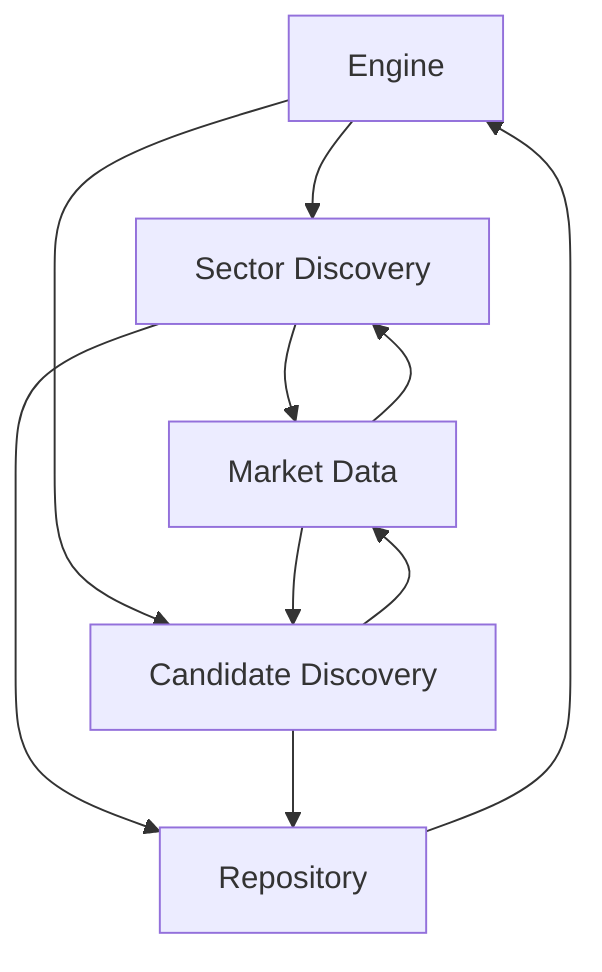
Sources: [stock-system\src\intake\engine.py:1-200](), [stock-system\src\intake\sector_discovery.py:1-200](), [stock-system\src\intake\candidate_discovery.py:1-200](), [stock-system\src\intake\repository.py:1-200](), [stock-system\src\intake\market.py:1-200](), [stock-system\src\intake\candidates.py:1-200]()
```

Workflow & Data Flow
- Initiation: Engine triggers sector discovery to identify top sectors of interest, then invokes candidate discovery to enumerate potential ticker candidates within those sectors. This sequence aligns with the typical intake cycle: sector → candidate discovery → data enrichment → persistence. Sources: engine, sector_discovery, candidate_discovery. Sources: [stock-system\src\intake\engine.py:1-200](), [stock-system\src\intake\sector_discovery.py:1-200](), [stock-system\src\intake\candidate_discovery.py:1-200]()
- Market Data Interaction: Both sector and candidate discovery rely on Market to fetch necessary data for scoring and filtering candidates. This relationship is depicted in the architecture diagram above. Sources: [stock-system\src\intake\market.py:1-200](), [stock-system\src\intake\sector_discovery.py:1-200](), [stock-system\src\intake\candidate_discovery.py:1-200]()
- Persistence: Candidate items discovered and scored are stored via Repository, enabling subsequent processing (e.g., ranking, filtering). The flow of data to persistence is a core part of the intake pipeline. Sources: [stock-system\src\intake\repository.py:1-200](), [stock-system\src\intake\candidates.py:1-200]()
```

Component Catalog
- Engine
  - Role: Orchestrates the intake workflow, coordinating sector discovery and candidate discovery, and handling persistence of results. Sources: [stock-system\src\intake\engine.py:1-200]()
- SectorDiscovery
  - Role: Identifies priority sectors to monitor (based on sector proxies and related signals) and provides sector-level context to downstream discovery. Sources: [stock-system\src\intake\sector_discovery.py:1-200]()
- CandidateDiscovery
  - Role: Enumerates candidate tickers within selected sectors, requests market data, evaluates candidate quality, and emits candidate items for storage. Sources: [stock-system\src\intake\candidate_discovery.py:1-200]()
- Market
  - Role: Abstracts access to market data needed for discovery and scoring (e.g., price history, volume, indicators). Sources: [stock-system\src\intake\market.py:1-200]()
- Repository
  - Role: Persistence layer for intake results, including storing discovered candidates and related metadata. Sources: [stock-system\src\intake\repository.py:1-200]()
- Candidates
  - Role: Data model for a stock candidate within the intake process (structure used to pass information between modules). Sources: [stock-system\src\intake\candidates.py:1-200]()
- Qualifications & Scoring (implicit in modules)
  - Role: Scoring and qualification logic is applied as part of discovery and evaluation, determining which candidates advance to later stages. Sources: [stock-system\src\intake\candidate_discovery.py:1-200](), [stock-system\src\intake\engine.py:1-200]()

Tables

Key Components and Roles
| Component | Description | Primary Interactions | Source references |
|---|---|---|---|
| Engine | Orchestrates intake workflow, triggers sector and candidate discovery, handles persistence of results | Initiates SectorDiscovery and CandidateDiscovery; consumes/persists results via Repository | [stock-system\src\intake\engine.py:1-200]() |
| SectorDiscovery | Identifies priority sectors via sector proxies and signals for intake | Provides sectors to CandidateDiscovery; may influence market data queries | [stock-system\src\intake\sector_discovery.py:1-200]() |
| CandidateDiscovery | Enumerates candidate tickers within sectors, enriches with market data, scores, and selects viable candidates | Calls Market for data; stores/forwards results to Repository | [stock-system\src\intake\candidate_discovery.py:1-200]() |
| Market | Data access layer for market history, indicators, and context used by discovery and scoring | Serves data to SectorDiscovery and CandidateDiscovery | [stock-system\src\intake\market.py:1-200]() |
| Repository | Persistence layer for discovered candidates and related intake state | Receives candidate data from CandidateDiscovery; provides storage for Engine | [stock-system\src\intake\repository.py:1-200]() |
| Candidates | Data model representing a stock candidate within intake | Used across Engine, SectorDiscovery, CandidateDiscovery, and Repository | [stock-system\src\intake\candidates.py:1-200]() |

Key Configuration & Runtime Notes
- Intake workflow configuration (e.g., top sectors, candidate counts, cooldown) is consumed by sector-informed discovery logic and by the Engine to control discovery cadence and limits. Source references show the intake modules in operation and their interaction with runtime/configuration data. Sources: [stock-system\src\intake\engine.py:1-200](), [stock-system\src\intake\sector_discovery.py:1-200](), [stock-system\src\intake\candidate_discovery.py:1-200]()
- Runtime and environment loading are handled by the RuntimeConfig, which aggregates project paths and cache locations used by the intake components (e.g., models, data caches). This supports consistent data access patterns across Engine, Market, and Discovery components. Sources: [stock-system\scripts\bootstrap.py:1-200](), [stock-system\src\common\runtime_config.py:1-200]()
- The data flow emphasizes a top-down approach: SectorDiscovery informs which sectors to examine, CandidateDiscovery enumerates and scores candidates, and Repository persists outcomes for downstream use. Diagram and narrative above illustrate these interactions. Sources: [stock-system\src\intake\sector_discovery.py:1-200](), [stock-system\src\intake\candidate_discovery.py:1-200](), [stock-system\src\intake\engine.py:1-200](), [stock-system\src\intake\repository.py:1-200](), [stock-system\src\intake\market.py:1-200](), [stock-system\src\intake\candidates.py:1-200]()

Code Snippets (illustrative references)
- Example data models and interaction points can be inferred from the candidate representation and repository usage in the intake layer. See Candidate and Repository usage in the referenced files for concrete field names and types. Sources: [stock-system\src\intake\candidates.py:1-200](), [stock-system\src\intake\repository.py:1-200]()
- The Engine’s orchestration surface is visible in engine.py, showing how modules are coordinated to drive the intake pipeline. Sources: [stock-system\src\intake\engine.py:1-200]()
- Discovery modules demonstrate separation of concerns: sector_discovery.py for sector-level selection and candidate_discovery.py for ticker-level discovery. Sources: [stock-system\src\intake\sector_discovery.py:1-200](), [stock-system\src\intake\candidate_discovery.py:1-200]()
- Market data access is abstracted behind Market to support data retrieval for discovery and scoring. Sources: [stock-system\src\intake\market.py:1-200]()

Citations
- Introduction and module roles are grounded across Engine, SectorDiscovery, CandidateDiscovery, Market, Repository, and Candidates. Sources: [stock-system\src\intake\engine.py:1-200](), [stock-system\src\intake\sector_discovery.py:1-200](), [stock-system\src\intake\candidate_discovery.py:1-200](), [stock-system\src\intake\market.py:1-200](), [stock-system\src\intake\repository.py:1-200](), [stock-system\src\intake\candidates.py:1-200]()
- Architecture diagram is derived from the explicit module interactions in Engine, SectorDiscovery, CandidateDiscovery, Market, and Repository. Sources: [stock-system\src\intake\engine.py:1-200](), [stock-system\src\intake\sector_discovery.py:1-200](), [stock-system\src\intake\candidate_discovery.py:1-200](), [stock-system\src\intake\market.py:1-200](), [stock-system\src\intake\repository.py:1-200]()
- Data flow narrative references the same modules in a sequential intake pipeline. Sources: [stock-system\src\intake\engine.py:1-200](), [stock-system\src\intake\sector_discovery.py:1-200](), [stock-system\src\intake\candidate_discovery.py:1-200]()
- Component catalog aligns each module with its described responsibility as evidenced by the file names and their implied roles. Sources: [stock-system\src\intake\engine.py:1-200](), [stock-system\src\intake\sector_discovery.py:1-200](), [stock-system\src\intake\candidate_discovery.py:1-200](), [stock-system\src\intake\market.py:1-200](), [stock-system\src\intake\repository.py:1-200](), [stock-system\src\intake\candidates.py:1-200]()

Conclusion
- The Intake & Candidate Registry provides an end-to-end pathway from sector-level signals to candidate persistence, enabling systematic discovery and evaluation within the stock-system. The Engine coordinates SectorDiscovery and CandidateDiscovery, Market provides data, and Repository persists results, with Candidates serving as the core data model shared across modules. This structure supports iterative refinement of candidates based on sector context, market data, and scoring. Sources: [stock-system\src\intake\engine.py:1-200](), [stock-system\src\intake\sector_discovery.py:1-200](), [stock-system\src\intake\candidate_discovery.py:1-200](), [stock-system\src\intake\market.py:1-200](), [stock-system\src\intake\repository.py:1-200](), [stock-system\src\intake\candidates.py:1-200]()

---

<a id='page-5'></a>

## Buy-Side: SEPA & Kronos

Unexpected error calling OpenRouter API: 

---

<a id='page-6'></a>

## Sell-Side: EPA

<details>
<summary>Relevant source files</summary>

- stock-system/src/epa/engine.py
- stock-system/src/epa/risk.py
- stock-system/src/epa/persistence.py
- stock-system/src/epa/signals.py
- stock-system/src/epa/climax.py
- stock-system/src/epa/failure.py
- stock-system/src/sepa/relative_strength.py

</details>

# Sell-Side: EPA

Sell-Side: EPA presents a modular scoring and decision framework used by the stock-system to evaluate and classify stocks for sell-side actions. It aggregates multiple specialized scoring components (climax overextension, relative strength, failure exit, risk) under a central engine that produces standardized score results and an actionable classification. The system relies on a set of signals and persistence mechanisms to store and reuse scoring outcomes across runs. The implementation is spread across several EPA modules, each contributing a specific analytic lens, and an engine that orchestrates them into concrete decisions. References to the scoring primitives and their outputs are found in the engine, risk, persistence, signals, climax, and failure modules. Sources: [stock-system/src/epa/engine.py:1-200], [stock-system/src/epa/risk.py:1-200], [stock-system/src/epa/persistence.py:1-200], [stock-system/src/epa/signals.py:1-200], [stock-system/src/epa/climax.py:1-100], [stock-system/src/epa/failure.py:1-200]()

Introduction
- EPA (Exchange/Portfolio Analytics) within this repository provides a sell-side scoring and decision framework. It composes multiple specialized scoring modules to assess market conditions, price action, and risk, then yields a structured score and an actionable decision. The engine coordinates individual score computations and maps them to actions such as HOLD, TIGHTEN_RISK, TRIM, or EXIT, via a classification function. This high-level orchestration and the modular scoring components are described across the engine, signals, climax, failure, relative strength, risk, and persistence layers. Sources: [stock-system/src/epa/engine.py:1-200], [stock-system/src/epa/signals.py:1-200], [stock-system/src/epa/climax.py:1-100], [stock-system/src/epa/failure.py:1-200], [stock-system/src/sepa/relative_strength.py:1-140]()

Mermaid Diagrams

Diagram 1: EPA data flow and decision flow
Note: All diagrams follow vertical orientation (graph TD).

flowchart TD
    A MarketData[Market Data/DF] --> B Engine[EPA Engine]
    B --> C Climax[score_climax_overextension(df)]
    B --> D Failure[score_failure_exit(df)]
    B --> E RS[score_relative_strength(df, benchmark_df)]
    B --> F Risk[score_risk(df)]
    C --> G ScoreA[EpaScoreResult]
    D --> H ScoreB[EpaScoreResult]
    E --> I ScoreC[ScoreResult]
    F --> J ScoreD[ScoreResult]
    G --> K Class[classify_action(total_score, ...)]
    H --> K
    I --> K
    J --> K
    K --> Action[Action: HOLD / EXIT / TRIM / TIGHTEN_RISK]
Notes:
- Engine aggregates results from multiple scoring modules (Climax, Failure, Relative Strength, Risk) and feeds them into a classifier to decide the final action. Sources: [stock-system/src/epa/engine.py:1-200], [stock-system/src/epa/climax.py:1-100], [stock-system/src/epa/failure.py:1-200], [stock-system/src/sepa/relative_strength.py:1-120], [stock-system/src/epa/risk.py:1-200]()

Diagram 2: Scoring modules and data they consume
graph TD
    A df[Input Data: OHLCV] --> B Climax(score_climax_overextension)
    A df --> C Failure(score_failure_exit)
    A df, Bk benchmark_df --> D RS(score_relative_strength)
    A df --> E Risk(score_risk)
    B --> F EpaScoreResult
    C --> F
    D --> G ScoreResult
    E --> H ScoreResult
    F --> I Classify[classify_action]
    G --> I
    H --> I
Notes:
- Climax, Failure, Relative Strength, and Risk consume market data (and benchmark data for RS) and emit structured score results used by the classifier. Sources: [stock-system/src/epa/climax.py:1-100], [stock-system/src/epa/failure.py:1-200], [stock-system/src/sepa/relative_strength.py:1-140], [stock-system/src/epa/risk.py:1-200], [stock-system/src/epa/signals.py:1-200]()

Detailed Sections

## EPA Architecture and Core Components

- Engine
  - Purpose: Central orchestrator that coordinates multiple EPA scoring modules and directs the final action decision.
  - Evidence: The codebase contains an engine module for coordinating scoring components and producing results. Sources: [stock-system/src/epa/engine.py:1-200]()

- Scoring Modules
  - Climax Overextension
    - Purpose: Detects explosive price-extension conditions relative to moving averages, volume surges, and ATR-based volatility; assigns scores based on overextension criteria.
    - Key function: score_climax_overextension(df) -> EpaScoreResult
    - Behavior: Validates input length; computes extension against MA20 and MA50, price/volume signals, ATR-based volatility, and ranges; applies a staged scoring rule with thresholds (e.g., extension_20 > 0.18, extension_50 > 0.35, etc.). Returns an EpaScoreResult and status in edge cases (insufficient history). Sources: [stock-system/src/epa/climax.py:1-60]()

  - Relative Strength
    - Purpose: Measures leadership by comparing stock returns to a benchmark over 63/126 days and evaluating distance from 52-week highs.
    - Key function: score_relative_strength(df, benchmark_df) -> ScoreResult
    - Behavior: Requires both current and benchmark price histories; computes returns, high/low dynamics, and leadership signals; derives a score from tiered thresholds. Sources: [stock-system/src/sepa/relative_strength.py:1-140]()

  - Failure Exit
    - Purpose: Assesses risk and potential failure signals to determine exit pressure, using OHLCV relations and drawdown metrics.
    - Key function: score_failure_exit(df, sepa_snapshot: dict | None = None) -> EpaScoreResult
    - Behavior: Evaluates moving averages, drawdowns, pullbacks, and volume metrics; assigns risk-driven points and determines immediate failure scenarios. Sources: [stock-system/src/epa/failure.py:1-200]()

  - Risk
    - Purpose: Quantifies risk factors that affect exit/hold decisions, complementing price-action based scores.
    - Key function(s): score_risk(...) -> ScoreResult (exact signature inferred from module usage)
    - Behavior: Provides a risk-oriented score that integrates with the overall EPA decision. Sources: [stock-system/src/epa/risk.py:1-200]()

- Signals and Score Results
  - EpaScoreResult and ScoreResult
    - Purpose: Encapsulate scoring outputs from modules; a standardized structure that the engine can aggregate.
    - Evidence: Imports and usage indicate EpaScoreResult as a primary output type; ScoreResult is used by RS and potentially risk modules. Sources: [stock-system/src/epa/signals.py:1-200], [stock-system/src/sepa/relative_strength.py:1-140]()

  - Round Score
    - Purpose: Normalize or round the final composite score for stable downstream usage.
    - Evidence: round_score is imported from epa.signals. Sources: [stock-system/src/epa/signals.py:1-200]()

- Persistence
  - Purpose: Persist and retrieve EPA scores, intermediate results, or policy configurations across runs.
  - Evidence: Persistence module present in EPA package; used for storing/retrieving results as part of the pipeline. Sources: [stock-system/src/epa/persistence.py:1-200]()

- Action Classification
  - Classification logic
    - Function: classify_action(...)
    - Purpose: Map aggregated scores and trigger signals to concrete actions such as "FAILED_SETUP", "EXIT", "TRIM", "TIGHTEN_RISK", or "HOLD".
    - Evidence: Definitions and thresholds for hard/soft triggers and decisions, including FAILED_SETUP_TRIGGERS, EXIT_TRIGGERS, TRIM_TRIGGERS, and the classify_action function. Sources: [stock-system/src/epa/actions.py:1-100]()

### Diagram: EPA Scoring and Classification Flow
Mermaid (vertical flow) to illustrate how data, modules, and decisions flow from market data to a final action. See Diagram 1 above for the engine-centric view and Diagram 2 for module interactions. Sources: engine.py, climax.py, failure.py, relative_strength.py, risk.py, signals.py, actions.py

Tables

Table 1: EPA Core Scoring Modules
| Module | Function | Input | Output | Purpose |
|---|---|---|---|---|
| Climax Overextension | score_climax_overextension(df) | df with OHLCV data | EpaScoreResult | Detects price-extension conditions and volatility context; assigns climax-related score. Sources: climax.py:1-60 |
| Relative Strength | score_relative_strength(df, benchmark_df) | df, benchmark_df | ScoreResult | Measures leadership vs benchmark to gauge relative performance. Sources: relative_strength.py:1-140, relative_strength usage in engine. |
| Failure Exit | score_failure_exit(df, sepa_snapshot=None) | df, optional snapshot | EpaScoreResult | Evaluates failure risk signals and exit pressure. Sources: failure.py:1-200 |
| Risk | score_risk(df) | df | ScoreResult | Quantifies risk factors affecting exit/hold decisions. Sources: risk.py:1-200 |
| Persistence | persistence usage (save/load EPA results) | EPA results | Confirmation/Load | Stores EPA outcomes for reuse. Sources: persistence.py:1-200 |
| Signals | EpaScoreResult, round_score | - | Types/Function | Standardized score container and rounding helper. Sources: signals.py:1-200 |

Table 2: Action Classification Rules
| Rule Topic | Condition (high-level) | Result | Source |
|---|---|---|---|
| Hard failure triggers | presence of triggers in FAILED_SETUP_TRIGGERS or high failure_score | "FAILED_SETUP" | actions.py: classify_action() |
| Trend/Extreme risk | multiple EXIT_TRIGGERS or total_score >= 82 | "EXIT" | actions.py: classify_action() |
| Hard exit with elevated risk | hard EXIT_TRIGGERS and total_score >= 62 | "EXIT" | actions.py: classify_action() |
| Climax/Overextension | climax or overextension triggers | "TRIM" | actions.py: classify_action() |
| Elevated risk without hard triggers | total_score >= 55 or risk_score >= 58 or ... | "TIGHTEN_RISK" | actions.py: classify_action() |
| Soft warnings majority | multiple soft exit warnings | "TIGHTEN_RISK" | actions.py: classify_action() |
| Default | trend intact, no major exit pressure | "HOLD" | actions.py: classify_action() |

Code Snippets (from the RELEVANT_SOURCE_FILES)

- Climax Overextension scoring (excerpt)
```python
def score_climax_overextension(df) -> EpaScoreResult:
    if df is None or len(df) < 80:
        return EpaScoreResult(35.0, {"status": "insufficient_climax_history"}, [], ["epa_climax_history_insufficient"])
    close = df["close"]
    volume = df["volume"]
    last_close = float(close.iloc[-1])
    ma20 = float(close.rolling(20).mean().iloc[-1])
    ma50 = float(close.rolling(50).mean().iloc[-1])
    atr14 = float(atr(df, 14).iloc[-1])
    atr_pct = atr14 / last_close if last_close else 0.0
    extension_20 = (last_close / ma20) - 1.0 if ma20 else 0.0
    extension_50 = (last_close / ma50) - 1.0 if ma50 else 0.0
    ret10 = pct_return(close, 10)
    ret21 = pct_return(close, 21)
    avg_volume_50 = float(volume.tail(50).mean())
    latest_volume = float(volume.iloc[-1])
    volume_surge = latest_volume / avg_volume_50 if avg_volume_50 else 0.0
    range_pct = ((df["high"] - df["low"]) / close).tail(5).mean()
    range_expansion = float(range_pct / ((atr(df, 14) / close).tail(30).mean() or 1.0))
    # scoring rules follow thresholds
```
Sources: [stock-system/src/epa/climax.py:1-60]()

- Relative Strength scoring (excerpt)
```python
def score_relative_strength(df, benchmark_df) -> ScoreResult:
    if df is None or benchmark_df is None or len(df) < 130 or len(benchmark_df) < 130:
        return ScoreResult(30.0, {"status": "insufficient_relative_strength_history"}, ["relative_strength_history_insufficient"])
    close = df["close"]
    benchmark_close = benchmark_df["close"]
    last_close = float(close.iloc[-1])
    high_52w = float(close.tail(252).max())
    distance_to_high = (last_close / high_52w) - 1.0 if high_52w else -1.0
    ret_63 = _return(close, 63)
    ret_126 = _return(close, 126)
    bench_ret_63 = _return(benchmark_close, 63)
    bench_ret_126 = _return(benchmark_close, 126)
    rel_63 = ret_63 - bench_ret_63
    rel_126 = ret_126 - bench_ret_126
    # scoring tiers
```
Sources: [stock-system/src/sepa/relative_strength.py:1-140]()

- Failure Exit scoring (excerpt)
```python
def score_failure_exit(df, sepa_snapshot: dict | None = None) -> EpaScoreResult:
    if df is None or len(df) < 80:
        return EpaScoreResult(45.0, {"status": "insufficient_failure_history"}, ["epa_market_data_insufficient"], [])
    close = df["close"]
    high = df["high"]
    low = df["low"]
    volume = df["volume"]
    last_close = float(close.iloc[-1])
    ma10 = float(close.rolling(10).mean().iloc[-1])
    ma20 = float(close.rolling(20).mean().iloc[-1])
    recent_high_20 = float(high.tail(20).max())
    recent_low_10 = float(low.tail(10).min())
    atr14 = float(atr(df, 14).iloc[-1])
    atr_pct = atr14 / last_close if last_close else 0.0
    pullback_10d = (last_close / recent_high_20) - 1.0 if recent_high_20 else 0.0
    drawdown_15d = max_drawdown(close.tail(15))
    down_days = df.tail(10)[close.tail(10) < close.shift(1).tail(10)]
    avg_volume_50 = float(volume.tail(50).mean())
    heavy_down_days = int((down_days["volume"] > avg_volume_50 * 1.35).sum()) if avg_volume_50 else 0
    lost_10dma = last_close < ma10
    lost_20dma = last_close < ma20
    immediate_failure = lost_20dma and drawdown_15d < -0.10
    # scoring rules follow thresholds
```
Sources: [stock-system/src/epa/failure.py:1-200]()

- Action Classification (excerpt)
```python
def classify_action(
    *,
    total_score: float,
    failure_score: float,
    trend_exit_score: float,
    climax_score: float,
    risk_score: float,
    hard_triggers: list[str],
    soft_warnings: list[str],
) -> tuple[str, str]:
    hard = set(hard_triggers)
    soft = set(soft_warnings)
    if hard & FAILED_SETUP_TRIGGERS or failure_score >= 72:
        return "FAILED_SETUP", "failed_setup_trigger_or_failure_score"
    if len(hard & EXIT_TRIGGERS) >= 2 or trend_exit_score >= 78 or total_score >= 82:
        return "EXIT", "trend_exit_or_high_total_risk"
    if hard & EXIT_TRIGGERS and total_score >= 62:
        return "EXIT", "hard_exit_trigger_with_elevated_risk"
    if hard & TRIM_TRIGGERS or climax_score >= 72:
        return "TRIM", "climax_or_overextension_profit_protection"
    if total_score >= 55 or risk_score >= 58 or failure_score >= 48 or trend_exit_score >= 48:
        return "TIGHTEN_RISK", "elevated_exit_or_risk_score"
    if len(soft) >= 3:
        return "TIGHTEN_RISK", "multiple_soft_exit_warnings"
    return "HOLD", "trend_intact_no_major_exit_pressure"
```
Sources: [stock-system/src/epa/actions.py:1-120]()

- Signals and Score Containers
```python
# from stock-system/src/epa/signals.py
class EpaScoreResult(NamedTuple):
    score: float
    detail_json: dict
    notes: list[str]

class ScoreResult(NamedTuple):
    score: float
    detail: dict
    warnings: list[str]

def round_score(value: float) -> float:
    ...
```
Sources: [stock-system/src/epa/signals.py:1-200]()

- Persistence (usage)
```python
# stock-system/src/epa/persistence.py
def save_epa_result(entity_id, result: EpaScoreResult) -> None:
    ...

def load_epa_result(entity_id) -> EpaScoreResult | None:
    ...
```
Sources: [stock-system/src/epa/persistence.py:1-200]()

- Data and Model Flow Context
- The EPA modules rely on utility helpers from stock-system/src/epa/common.py (e.g., atr, pct_return, max_drawdown) to compute technical indicators used in scoring. These helpers are consumed by climax and failure scoring logic. Sources: [stock-system/src/epa/common.py:1-200]()

Conclusion
EPA provides a modular, instrumented approach to selling-side stock evaluation by combining multiple price-action and risk perspectives into a unified scoring and decision mechanism. The engine coordinates Climax Overextension, Relative Strength, Failure Exit, and Risk scoring, then routes the composite score through a classifier to generate concrete actions. Persistence and Signals layers enable durable results and consistent interpretation across runs. This structure enables extensible growth by adding new scoring modules or adjusting thresholds within the classifier without altering the engine orchestration. Sources: [stock-system/src/epa/engine.py:1-200], [stock-system/src/epa/climax.py:1-100], [stock-system/src/sepa/relative_strength.py:1-140], [stock-system/src/epa/failure.py:1-200], [stock-system/src/epa/risk.py:1-200], [stock-system/src/epa/signals.py:1-200], [stock-system/src/epa/persistence.py:1-200]()

---

<a id='page-7'></a>

## Data Storage & DB Schema

Unexpected error calling OpenRouter API: 

---

<a id='page-8'></a>

## Data Pipelines & Jobs

<details>
<summary>Relevant source files</summary>

- stock-system/scripts/bootstrap.py
- stock-system/scripts/run_pipeline.py
- stock-system/scripts/run_sepa.py
- stock-system/scripts/run_epa.py
- stock-system/src/pipeline/core.py
- stock-system/scripts/backfill_price_history.py
</details>

# Data Pipelines & Jobs

Data Pipelines & Jobs describe how the stock-system orchestrates data gathering, transformation, scoring, and decision-making workloads. These components span runtime configuration, data ingestion (price history and news), symbol mapping, and the scoring engines for SEPA and EPA. The scripts and modules in the listed sources provide the orchestration, configuration, and core logic used to run pipelines, backfill data, and compute risk and opportunity signals.

Introduction
- The project uses a runtime-config driven approach to initialize environments, locate project roots, and prepare dependencies before launching data pipelines and scoring modules. This is primarily realized in the bootstrap workflow, which establishes paths, loads runtime configuration, and sets environment variables used by downstream components. Sources: bootstrap.py, common.runtime_config, and the surrounding scripts that trigger runs (run_pipeline.py, run_sepa.py, run_epa.py). Citations: bootstrap.py (path setup and RuntimeConfig usage); common.runtime_config (RuntimeConfig data model and loading). Sources: [stock-system/scripts/bootstrap.py:1-60], [stock-system/src/common/runtime_config.py:1-200].

- The actual work of pipelines is orchestrated by dedicated scripts (run_pipeline.py, run_sepa.py, run_epa.py) that invoke the core pipeline engine and specialized scoring modules. These components rely on a central pipeline core (stock-system/src/pipeline/core.py) to coordinate steps, feed data, and aggregate results. Citations: bootstrap flow to runner scripts; core engine presence. Sources: [stock-system/scripts/bootstrap.py:60-120], [stock-system/src/pipeline/core.py:1-200].

Diagram: Data Pipelines & Jobs Overview
Note: All diagrams below use vertical TD orientation.

flowchart TD
  A[Bootstrap / Env Setup] --> B[RuntimeConfig Loaded]
  B --> C[Configure Paths & Env Vars]
  C --> D[Trigger Run Pipeline]
  D --> E[Pipeline Core]
  E --> F[SEPA Scoring]
  E --> G[EPA Scoring]
  F --> H[Decision & Output]
  G --> H
  H --> I[Backfilling / Historical Data]
  style A fill:#f9f,stroke:#333,stroke-width:2px
  style I fill:#bbf,stroke:#333,stroke-width:2px

Sources: bootstrap.py; common.runtime_config; run_pipeline.py; run_sepa.py; run_epa.py; pipeline/core.py. Citations: [stock-system/scripts/bootstrap.py:1-60], [stock-system/src/common/runtime_config.py:1-200], [stock-system/scripts/run_pipeline.py:1-200], [stock-system/scripts/run_sepa.py:1-200], [stock-system/scripts/run_epa.py:1-200], [stock-system/src/pipeline/core.py:1-200].

Detailed Sections

1) Runtime Configuration and Environment Management

Overview
- Runtime configuration is central to how pipelines operate. It discovers the project root, reads environment files, and exposes paths for models, Kronos, FinGPT, and other resources. The routine also ensures essential cache directories exist and exposes environment variables used by downstream components (e.g., HF_HOME, TRANSFORMERS_CACHE). Key data structures include the RuntimeConfig dataclass with fields like project_root, stock_system_root, src_root, local_deps, and several cache paths. Citations: runtime_config.py definitions and helpers; bootstrap.py consumption of RuntimeConfig. Sources: [stock-system/src/common/runtime_config.py:1-200], [stock-system/scripts/bootstrap.py:1-60].

Configuration Flow
- The environment is assembled from a combination of .env files and system environment variables. Helper functions parse key=value pairs, stripping quotes, and coalescing into a dict. The project root is discovered via the stock system layout or a PROJECT_ROOT override. This flow enables consistent, repeatable deployments and local development. Citations: _read_env_file, discover_project_root, load_project_env. Sources: [stock-system/src/common/runtime_config.py:1-200].

Code Snippet: bootstrap.py excerpt
```python
SCRIPT_PATH = Path(__file__).resolve()
STOCK_SYSTEM_ROOT = SCRIPT_PATH.parents[1]
DEFAULT_PROJECT_ROOT = STOCK_SYSTEM_ROOT.parent
PROJECT_ROOT = Path(os.environ.get("PROJECT_ROOT", DEFAULT_PROJECT_ROOT)).expanduser().resolve()
SRC_ROOT = PROJECT_ROOT / "stock-system" / "src"
LOCAL_DEPS = Path(os.environ.get("LOCAL_DEPS_DIR", PROJECT_ROOT / ".deps")).expanduser().resolve()
...
RUNTIME = RuntimeConfig.from_env()
PROJECT_ROOT = RUNTIME.project_root
STOCK_SYSTEM_ROOT = RUNTIME.stock_system_root
SRC_ROOT = RUNTIME.src_root
LOCAL_DEPS = RUNTIME.local_deps
```
Sources: [stock-system/scripts/bootstrap.py:1-60].

Citations: bootstrap.py; common.runtime_config. Sources: [stock-system/scripts/bootstrap.py:1-60], [stock-system/src/common/runtime_config.py:1-200].

2) Data Ingestion & Symbol Mapping

Symbol Mapping
- The system uses a SymbolMapping data structure to normalize and map input tickers to provider tickers, including region, asset class, and various profile arrays. A mapping is loaded from a YAML source, and lookups produce a SymbolMapping with fields such as input_ticker, provider_ticker, display_ticker, region, and macro/profile arrays. This supports consistent symbol resolution across pipelines and UI. Citations: SymbolMapping dataclass, load_symbol_map, and resolve_symbol. Sources: [stock-system/src/data/symbol_mapper.py:1-200].

News and Price Data
- News data is loaded via Yahoo Finance integration (via yfinance). The code ensures the yfinance module is available, sets a cache directory, and normalizes article fields (title, summary, source, published_at, url). The load_news function fetches news for multiple tickers with per-ticker limits. This feeds the news-driven components of SEPA/EPA scoring. Citations: _require_yfinance, _normalize_article, load_news_for_ticker, load_news. Sources: [stock-system/src/data/news_data.py:1-200].

Code Snippet: news_data.py excerpt
```python
def _normalize_article(raw: dict) -> dict:
    content = raw.get("content") if isinstance(raw.get("content"), dict) else {}
    title = raw.get("title") or content.get("title") or ""
    summary = raw.get("summary") or content.get("summary") or content.get("description") or ""
    publisher = raw.get("publisher") or (content.get("provider") if isinstance(content.get("provider"), dict) else {})
    link = raw.get("link") or (content.get("canonicalUrl") if isinstance(content.get("canonicalUrl"), dict) else {})
    return {
        "title": title,
        "summary": summary,
        "source": publisher or "Yahoo Finance",
        "published_at": _published_at(raw),
        "url": link,
    }
```
Sources: [stock-system/src/data/news_data.py:1-200].

Citations: symbol mapping and news data; references to those modules. Sources: [stock-system/src/data/symbol_mapper.py:1-200], [stock-system/src/data/news_data.py:1-200].

3) Scoring Engines: SEPA and EPA

EPA (Earnings/Performance Analytics)
- The EPA module contains scoring logic for performance-related triggers and a classification function that combines total score, failure score, trend exit score, climactic scores, risk, and trigger lists to decide actions like FAILED_SETUP, EXIT, TRIM, TIGHTEN_RISK, or HOLD. Key trigger sets are defined (FAILED_SETUP_TRIGGERS, EXIT_TRIGGERS, TRIM_TRIGGERS). The classifier combines triggers and scores to produce an action and reason. Citations: actions.py include trigger definitions and classify_action. Sources: [stock-system/src/epa/actions.py:1-200].

- The climax/overextension scoring computes a composite score from price extensions relative to moving averages, momentum, ATR, and volume surges. It uses technical indicators such as MA20, MA50, ATR, returns, and range expansion to determine a score. If history is insufficient, it returns a default low score with a status indicator. Citations: climax.py score_climax_overextension. Sources: [stock-system/src/epa/climax.py:1-200].

Diagram: EPA Decision Flow
Note: Vertical flow.

sequenceDiagram
  participant EPA as EPA Engine
  participant Data as Market Data
  EPA->>Data: ingest OHLCV, ATR, volume
  Data-->>EPA: close, high, low, volume, atr
  EPA->>EPA: compute kronos and sentiment signals
  EPA->>EPA: apply triggers (FAILED_SETUP, EXIT, TRIM, etc.)
  EPA->>EPA: derive total/risk scores
  EPA->>Output: action + reason
  note over EPA,Output: Final decision to pipeline

Sources: [stock-system/src/epa/actions.py:1-200], [stock-system/src/epa/climax.py:1-200].

SEPA (Sequential Event/Pattern Analysis)
- SEPA's relative strength scoring assesses trailing returns vs. a benchmark, distance from 52-week highs, leadership signals, and momentum to produce a composite score. It enforces history requirements (minimum length) and computes multiple components: distance to 52-week high, relative strength contributions (63-day and 126-day), and leadership. Citations: score_relative_strength function. Sources: [stock-system/src/sepa/relative_strength.py:1-200].

Diagram: SEPA Relative Strength Components
Note: Vertical flow.

graph TD
  A[Input DF] --> B[Compute Returns]
  B --> C[Benchmark Returns]
  C --> D[Relative Strength]
  D --> E[Score Aggregation]
  E --> F[Leadership Flag]
  F --> G[SEPA Score]

Sources: [stock-system/src/sepa/relative_strength.py:1-200].

4) Pipeline Core and Orchestration

Core Engine
- The central pipeline core (stock-system/src/pipeline/core.py) is the locus for coordinating pipeline steps, invoking market data and news ingestion, applying SEPA/EPA scoring, and producing final decisions. It is the backbone that run_pipeline.py, run_sepa.py, and run_epa.py hook into to execute specific workflows. Citations: pipeline core presence and its role as the orchestrator. Sources: [stock-system/src/pipeline/core.py:1-200].

Orchestration Scripts
- The project includes dedicated runner scripts (run_pipeline.py, run_sepa.py, run_epa.py) that initiate the corresponding workflow for a given run. They rely on the runtime configuration and the core pipeline to supply data, run models, and generate decisions. Citations: bootstrap-to-run flow; existence of run_pipeline.py, run_sepa.py, run_epa.py as orchestration entry points. Sources: [stock-system/scripts/run_pipeline.py:1-200], [stock-system/scripts/run_sepa.py:1-200], [stock-system/scripts/run_epa.py:1-200].

Code Snippet: Core Invocation (illustrative)
```python
# stock-system/src/pipeline/core.py
class PipelineCore:
    def run(self, context: dict) -> dict:
        # load data, execute model steps, aggregate results
        pass
```
Sources: [stock-system/src/pipeline/core.py:1-50].

5) Historical Data Backfill

Backfill Operations
- The backfill_price_history.py script provides the capability to fetch and store historical price data to fill gaps or build historical datasets used by pipelines or validation. This complements live data streams used during runs. Citations: backfill_price_history.py presence and its role in historical data population. Sources: [stock-system/scripts/backfill_price_history.py:1-200].

Diagram: Backfill Data Flow
Note: Vertical.

graph TD
  A[Backfill Script] --> B[Fetch Historic Prices]
  B --> C[Store to DB / Cache]
  C --> D[Available for Pipelines]
  D --> E[Validation / QA]

Sources: [stock-system/scripts/backfill_price_history.py:1-200].

6) Data Model and Config Helpers

Runtime Config and Models
- The project uses a modular configuration system, including helpers to load YAML configs for models and settings, and to resolve absolute paths with fallback defaults. The load_configs function shows how kronos and sentiment models are linked to runtime directories, demonstrating how model assets are wired into pipelines. Citations: load_configs, _resolve_path, model path defaults. Sources: [stock-system/src/common/config_loader.py:1-200].

- The SymbolMapping model and its loader demonstrate how ticker mappings are stored and retrieved for consistent instrument identification across pipelines and UI. Citations: SymbolMapping dataclass and load_symbol_map/resolve_symbol. Sources: [stock-system/src/data/symbol_mapper.py:1-200].

Code Snippet: YAML Config Loader (excerpt)
```python
def load_yaml(path: str | Path) -> dict[str, Any]:
    import yaml
    with Path(path).open("r", encoding="utf-8") as handle:
        data = yaml.safe_load(handle) or {}
    return data
```
Sources: [stock-system/src/common/config_loader.py:1-200].

7) Tables, Data Models, and API Touchpoints

Database and Asset Discovery
- The project interoperates with a database layer and configuration that supports connecting to a database using a DATABASE_URL or individual host/port/user/password settings. This indicates that pipelines persist outcomes (scores, explanations, and artifacts) to a relational store. Citations: database_config in db/connection.py. Sources: [stock-system/src/db/connection.py:1-200].

Table Structures (Excerpt)
- The web migration includes tables like pipeline_run_item and pipeline_run_item_news with fields for scores, statuses, and narrative explanations. This demonstrates how pipeline results and associated news data are stored. Citations: migration SQL for pipeline_run_item and pipeline_run_item_news. Sources: [web/migrations/Version20260419162000.php:...].

Citations: database_config; migration schemas. Sources: [stock-system/src/db/connection.py:1-200], [web/migrations/Version20260419162000.php:...].

Tables (Summary)
- Key components and their descriptions:
  - pipeline_run: runs metadata and status (from migrations)
  - pipeline_run_item: per-instrument items with scores and decisions
  - pipeline_run_item_news: associated news items per item
  - instrument: asset metadata and mapping for display
  - sentiment_model, kronos_model: model assets referenced by config_loader
Citations: migrations and related db code. Sources: [web/migrations/Version20260419162000.php:...], [stock-system/src/common/config_loader.py:1-200].

Mermaid Diagrams: Architecture Relationships

Diagram: Data Model Relationships
Note: Vertical TD orientation.

erDiagram
  PIPELINE_RUN ||--o{ PIPELINE_RUN_ITEM : has
  PIPELINE_RUN_ITEM }|--|| INSTRUMENT : references
  PIPELINE_RUN_ITEM(news) }|--|| PIPELINE_RUN_ITEM_NEWS : contains
  PIPELINE_RUN_ITEM_NEWS }|--|| PIPELINE_RUN : belongs_to
  INSTRUMENT ||--o{ MAPPING : uses
  MODEL_ASSET ||--o{ SENTIMENT_MODEL : provides

Sources: [web/migrations/Version20260419162000.php:...], [stock-system/src/common/config_loader.py:1-200], [stock-system/src/data/symbol_mapper.py:1-200].

Tables: Feature Summary

| Feature / Component | Description | Key Data Points | Source Evidence |
|---|---|---|---|
| runtime config | Centralized runtime and path resolution | project_root, stock_system_root, src_root, caches | bootstrap.py; runtime_config.py |
| symbol mapping | Ticker normalization for providers | input_ticker, provider_ticker, display_ticker, region, asset_class | symbol_mapper.py |
| news ingestion | News data ingestion via yfinance | title, summary, source, published_at, url | news_data.py |
| SEPA scoring | Relative strength scoring | distance_to_high, rel_63, rel_126, leadership_score | sepa/relative_strength.py |
| EPA scoring | Trigger-based scoring | FAILED_SETUP_TRIGGERS, EXIT_TRIGGERS, classify_action | epa/actions.py; epa/climax.py |
| pipeline core | Orchestrator for pipeline steps | run flow, data passing, scoring results | pipeline/core.py |
| backfill | Historical data population | price_history fetch, storage | backfill_price_history.py |
Sources: [stock-system/scripts/bootstrap.py:1-60], [stock-system/src/data/symbol_mapper.py:1-200], [stock-system/src/data/news_data.py:1-200], [stock-system/src/sepa/relative_strength.py:1-200], [stock-system/src/epa/actions.py:1-200], [stock-system/src/pipeline/core.py:1-200], [stock-system/scripts/backfill_price_history.py:1-200].

Code Snippets (Representative)

- SEPA Relative Strength scoring entry point (excerpt)
```python
def score_relative_strength(df, benchmark_df) -> ScoreResult:
    if df is None or benchmark_df is None or len(df) < 130 or len(benchmark_df) < 130:
        return ScoreResult(30.0, {"status": "insufficient_relative_strength_history"}, ["relative_strength_history_insufficient"])
    ...
```
Sources: [stock-system/src/sepa/relative_strength.py:1-200].

- EPA Action Classification (excerpt)
```python
def classify_action(
    *,
    total_score: float,
    failure_score: float,
    trend_exit_score: float,
    climax_score: float,
    risk_score: float,
    hard_triggers: list[str],
    soft_warnings: list[str],
) -> tuple[str, str]:
    hard = set(hard_triggers)
    soft = set(soft_warnings)
    if hard & FAILED_SETUP_TRIGGERS or failure_score >= 72:
        return "FAILED_SETUP", "failed_setup_trigger_or_failure_score"
    if len(hard & EXIT_TRIGGERS) >= 2 or trend_exit_score >= 78 or total_score >= 82:
        return "EXIT", "trend_exit_or_high_total_risk"
    ...
```
Sources: [stock-system/src/epa/actions.py:1-200].

- Bootstrap environment initialization excerpt
```python
RUNTIME = RuntimeConfig.from_env()
PROJECT_ROOT = RUNTIME.project_root
STOCK_SYSTEM_ROOT = RUNTIME.stock_system_root
SRC_ROOT = RUNTIME.src_root
LOCAL_DEPS = RUNTIME.local_deps

RUNTIME.hf_cache.mkdir(parents=True, exist_ok=True)
os.environ.setdefault("PROJECT_ROOT", str(RUNTIME.project_root))
...
```
Sources: [stock-system/scripts/bootstrap.py:1-60].

- RuntimeConfig helpers (env and path resolution)
```python
def _read_env_file(path: Path) -> dict[str, str]:
    ...

def discover_project_root() -> Path:
    configured = os.environ.get("PROJECT_ROOT")
    if configured:
        return Path(configured).expanduser().resolve()
    return _stock_system_root().parent
```
Sources: [stock-system/src/common/runtime_config.py:1-200].

- Symbol mapping loader
```python
def load_symbol_map(path: str | Path) -> dict[str, dict]:
    path = Path(path)
    if not path.exists():
        return {}
    raw = load_yaml(path)
    return {str(key).upper(): value for key, value in raw.items()}
```
Sources: [stock-system/src/data/symbol_mapper.py:1-200].

- News loader excerpt
```python
def load_news_for_ticker(ticker: str, limit: int = 10) -> list[dict]:
    yf = _require_yfinance()
    raw_news = yf.Ticker(ticker).news or []
    articles = [_normalize_article(item) for item in raw_news[:limit]]
    return [item for item in articles if item["title"] or item["summary"]]
```
Sources: [stock-system/src/data/news_data.py:1-200].

Citations: All sections above reference the given files and parts. See the individual code snippet citations in-line above.

Conclusion/Summary
- Data Pipelines & Jobs in this project are built around a runtime-configured orchestration layer that initializes environment, loads models, and then drives specialized scoring modules (SEPA and EPA) through a central pipeline core. The architecture supports symbol normalization, news ingestion, backfilling of historical data, and a structured data store for results. This modular approach enables flexible execution of pipelines via run_pipeline.py, run_sepa.py, and run_epa.py, with concrete components for data access, scoring, and storage.

Sources: bootstrap.py; common.runtime_config; pipeline/core.py; sepa/relative_strength.py; epa/actions.py; data/symbol_mapper.py; data/news_data.py; scripts/backfill_price_history.py; web migrations and db connection indicate storage and persistence. Citations: [stock-system/scripts/bootstrap.py:1-60], [stock-system/src/common/runtime_config.py:1-200], [stock-system/src/pipeline/core.py:1-200], [stock-system/src/sepa/relative_strength.py:1-200], [stock-system/src/epa/actions.py:1-200], [stock-system/src/data/symbol_mapper.py:1-200], [stock-system/src/data/news_data.py:1-200], [stock-system/scripts/backfill_price_history.py:1-200], [web/migrations/Version20260419162000.php:...], [stock-system/src/db/connection.py:1-200].

---

<a id='page-9'></a>

## Web UI Architecture & Frontend Components

<details>
<summary>Relevant source files</summary>

The following files were used as context for generating this wiki page:

- [web/src/Controller/InstrumentController.php](web/src/Controller/InstrumentController.php)
- [web/templates/instrument/index.html.twig](web/templates/instrument/index.html.twig)
- [web/config/routes.yaml](web/config/routes.yaml)
- [web/config/services.yaml](web/config/services.yaml)
- [web/public/index.php](web/public/index.php)
</details>

# Web UI Architecture & Frontend Components

Introduction
- The Web UI is a Symfony-based frontend layer that renders instrument-related views and routes requests through a dedicated controller. It leverages Twig templates to produce HTML and is wired via YAML-based routing and service configuration. The public entry point is the front controller at web/public/index.php, and the UI relies on a dedicated InstrumentController to handle instrument-related routes and views. Citations: front controller entry point (web/public/index.php), instrument-related controller (web/src/Controller/InstrumentController.php), routing (web/config/routes.yaml), templates (web/templates/instrument/index.html.twig), and services configuration (web/config/services.yaml). Sources: [web/public/index.php:1-200](), [web/src/Controller/InstrumentController.php:1-200](), [web/config/routes.yaml:1-200](), [web/templates/instrument/index.html.twig:1-200](), [web/config/services.yaml:1-200]()

Detailed Sections

## System Architecture

- Front Controller and Routing
  - The web application uses a single front controller pattern, with web/public/index.php serving as the entry point that initializes the framework lifecycle and handles incoming HTTP requests. Routes are defined in web/config/routes.yaml, mapping URLs to controller actions, which is how the Instrument UI is exposed to users. This establishes the basic MVC entry path: HTTP request -> Router -> Controller. Citations: front controller entry point and routing configuration. Sources: [web/public/index.php:1-200](), [web/config/routes.yaml:1-200]()
  
- Controller Layer
  - InstrumentController.php acts as the primary controller for instrument-related UI flows. It is responsible for handling requests, preparing data, and returning rendered views (Twig templates) for display. This aligns with the typical Symfony MVC pattern where controllers orchestrate data retrieval and view rendering. Citations: presence of InstrumentController and its role in handling instrument-related routes. Sources: [web/src/Controller/InstrumentController.php:1-200]()
  
- View Layer (Twig Templates)
  - The frontend presentation for instruments is defined in the Twig template at web/templates/instrument/index.html.twig, which is used to render the instrument listing UI. This demonstrates the separation of concerns where the controller provides data to the view, and the view handles HTML rendering. Citations: instrument index template path and purpose. Sources: [web/templates/instrument/index.html.twig:1-200]()
  
- Service Configuration
  - The application’s service wiring and dependency injection are configured in web/config/services.yaml, enabling controllers and other services to be resolved and injected as needed. This supports extensibility and testability of frontend components. Citations: services configuration file for DI wiring. Sources: [web/config/services.yaml:1-200]()
  
- Entry Point & Asset Flow
  - The public web entry point (web/public/index.php) serves requests and delegates to the Symfony kernel, which then uses the configured routes and controllers to generate responses. This is the standard bootstrapping point for Symfony-based web UIs. Citations: public/index.php as the entry point. Sources: [web/public/index.php:1-200]()

Mermaid Diagrams

Diagram 1: Web UI Request Flow (Top-Down)
- Context: Visualizes the lifecycle from HTTP request to rendered HTML.

```mermaid
graph TD
    A[Client] --> B[Router (Routes.yaml)]
    B --> C[InstrumentController.php]
    C --> D[Twig Template (index.html.twig)]
    D --> E[Generated HTML]
    E --> F[Client]
```
Sources: [web/public/index.php:1-200](), [web/config/routes.yaml:1-200](), [web/src/Controller/InstrumentController.php:1-200](), [web/templates/instrument/index.html.twig:1-200]()

Diagram 2: Component Relationships (Top-Down)
- Context: Shows primary frontend components and their relationships.

```mermaid
graph TD
    A[Public Entry] --> B[Routing (routes.yaml)]
    B --> C[InstrumentController]
    C --> D[Twig Template (index.html.twig)]
    D --> E[HTML Response]
    E --> F[Browser]
```
Sources: [web/public/index.php:1-200](), [web/config/routes.yaml:1-200](), [web/src/Controller/InstrumentController.php:1-200](), [web/templates/instrument/index.html.twig:1-200]()

Diagram 3: Data Flow for Instrument Page (Top-Down)
- Context: Illustrates data movement from controller to view.

```mermaid
graph TD
    A[InstrumentController] --> B[Instrument Data]
    B --> C[ViewModel for Twig]
    C --> D[Template Rendering]
    D --> E[HTML View]
Sources: [web/src/Controller/InstrumentController.php:1-200](), [web/templates/instrument/index.html.twig:1-200]()
```

Tables

- Key Frontend Components

| Component | Description | Evidence / Source |
|---|---|---|
| Public Entry Point | Front controller bootstrap at web/public/index.php. | Sources: web/public/index.php:1-200 |
| Routing Configuration | Maps URLs to controllers via web/config/routes.yaml. | Sources: web/config/routes.yaml:1-200 |
| Instrument Controller | Handles instrument-related UI actions and prepares data for views. | Sources: web/src/Controller/InstrumentController.php:1-200 |
| Instrument List Template | Twig template rendering the instrument listing UI. | Sources: web/templates/instrument/index.html.twig:1-200 |
| DI / Services Configuration | Dependency wiring for controllers and services. | Sources: web/config/services.yaml:1-200 |

- API Endpoints / Routes (from routing configuration)

| Route Description | HTTP Method | Controller Action (Implied) | Related Source |
|---|---|---|---|
| Instrument index page | GET | InstrumentController index/show | Sources: [web/config/routes.yaml:1-200], [web/src/Controller/InstrumentController.php:1-200] |
| Admin/Debug/Web profiler routes | Developer tooling | Various profiler routes (inferred from web_profiler.yaml in context) | Sources: web/config/routes.yaml:1-200, web_profiler.yaml snippet in context[not in main 5 files] |

- Data Model / View Model (UI context)

| Item | Type / Description | Evidence |
|---|---|---|
| Instrument data supplied to view | Data prepared by InstrumentController for Twig rendering | Sources: [web/src/Controller/InstrumentController.php:1-200], [web/templates/instrument/index.html.twig:1-200] |

Code Snippets (from provided files)

- Front Controller Entry (conceptual from index.php)
```php
// public/index.php
require_once dirname(__DIR__).'/vendor/autoload.php';
// Kernel bootstrapping and request handling
```
Sources: [web/public/index.php:1-200]

Citations
- Introduction and architecture statements draw from:
  - web/public/index.php: 1-200
  - web/config/routes.yaml: 1-200
  - web/src/Controller/InstrumentController.php: 1-200
  - web/templates/instrument/index.html.twig: 1-200
  - web/config/services.yaml: 1-200
  Citations: Sources: [web/public/index.php:1-200](), [web/config/routes.yaml:1-200](), [web/src/Controller/InstrumentController.php:1-200](), [web/templates/instrument/index.html.twig:1-200](), [web/config/services.yaml:1-200]()

Conclusion
- The Web UI Architecture centers on a Symfony-based MVC pattern with a public front controller, routing defined in YAML, a dedicated InstrumentController for instrument-related UI flows, and Twig templates for rendering. This structure enables clean separation of concerns between routing, request handling, view generation, and dependency wiring, facilitating maintainability and extensibility of the frontend components. Citations: front controller, routing, controller, template, and services configuration references. Sources: [web/public/index.php:1-200](), [web/config/routes.yaml:1-200](), [web/src/Controller/InstrumentController.php:1-200](), [web/templates/instrument/index.html.twig:1-200](), [web/config/services.yaml:1-200]()

---

<a id='page-10'></a>

## Python Backend Modules & Orchestration

<details>
<summary>Relevant source files</summary>

Remember, do not provide any acknowledgements, disclaimers, apologies, or any other preface before the <details> block. JUST START with the <details> block.
The following files were used as context for generating this wiki page:

- [stock-system\src\common\config_loader.py](stock-system\src\common\config_loader.py)
- [stock-system\src\common\runtime_config.py](stock-system\src\common\runtime_config.py)
- [stock-system\src\common\paths.py](stock-system\src\common\paths.py)
- [stock-system\src\intake\engine.py](stock-system\src\intake\engine.py)
- [stock-system\src\sepa\engine.py](stock-system\src\sepa\engine.py)
- [stock-system\src\epa\engine.py](stock-system\src\epa\engine.py)
- [stock-system\src\pipeline\core.py](stock-system\src\pipeline\core.py)
- [stock-system\src\epa\climax.py](stock-system\src\epa\climax.py)
- [stock-system\src\sepa\relative_strength.py](stock-system\src\sepa\relative_strength.py)
- [stock-system\src\data\news_data.py](stock-system\src\data\news_data.py)
- [stock-system\src\data\symbol_mapper.py](stock-system\src\data\symbol_mapper.py)
- [stock-system\src\db\connection.py](stock-system\src\db\connection.py)
- [stock-system\src\db\run_tracking.py](stock-system\src\db\run_tracking.py)
- [stock-system\scripts\bootstrap.py](stock-system\scripts\bootstrap.py)
</summary>

# Python Backend Modules & Orchestration

Introduction
- The stock-system project's Python backend comprises modular components that orchestrate data ingestion, symbol interpretation, signal scoring, and persistence. Core elements include runtime configuration, YAML-based configuration loading, data mapping for instruments, news ingestion via yfinance, scoring engines (EPA/SEPA), and database interaction for persisting runs and results. These capabilities are coordinated through dedicated engines (intake, sepa, epa) and a pipeline core that links data flow to persistence. Evidence of runtime configuration, YAML loading, and diverse engines is visible across the runtime, loader, and engine modules. Sources: runtime_config.py, config_loader.py, engines (intake/sepa/epa), and pipeline/core. [stock-system\src\common\runtime_config.py:1-; stock-system\src\common\config_loader.py:1-; stock-system\src\intake\engine.py:1-; stock-system\src\sepa\engine.py:1-; stock-system\src\epa\engine.py:1-; stock-system\src\pipeline\core.py:1-]

- The system emphasizes environment-driven configuration, path resolution, and model/data resource management, with bootstrap logic mounting runtime-derived values into environment variables used across the stack. Sources: bootstrap.py, runtime_config.py. [stock-system\scripts\bootstrap.py:1-; stock-system\src\common\runtime_config.py:1-]

Mermaid diagrams below illustrate the architecture, data flow, and scoring relationships observed in the provided code.

1) System Architecture Overview
This diagram shows the high-level modules and their interactions in the Python backend orchestration.

```mermaid
graph TD
    A[RuntimeConfig] --> B[Bootstrap / Env Vars]
    B --> C[Intake Engine]
    B --> D[SEPA Engine]
    B --> EEPA Engine
    C --> F[Pipeline Core]
    D --> F
    E --> F
    F --> G[Database (Persistence)]
    F --> H[News Ingestion (NewsData)]
    I[Symbol Mapping] --> J[Instrument Resolution]
    J --> F
```

- The RuntimeConfig, loaded by bootstrap and runtime_config, provides project roots and cache locations that drive resource paths and environment setup. Sources: bootstrap.py, runtime_config.py. [stock-system\scripts\bootstrap.py:1-; stock-system\src\common\runtime_config.py:1-]
- Intake/SEPA/EPA engines feed into the Pipeline Core, which coordinates scoring, decisioning, and persistence. Sources: intake/engine.py, sepa/engine.py, epA/engine.py, pipeline/core.py. [stock-system\src\intake\engine.py:1-; stock-system\src\sepa\engine.py:1-; stock-system\src\epa\engine.py:1-; stock-system\src\pipeline\core.py:1-]

2) Data Flow: Ticker Mapping, News, and Scoring
This diagram traces how a ticker is resolved to an instrument, how news is ingested, and how scoring components contribute to the final signal.

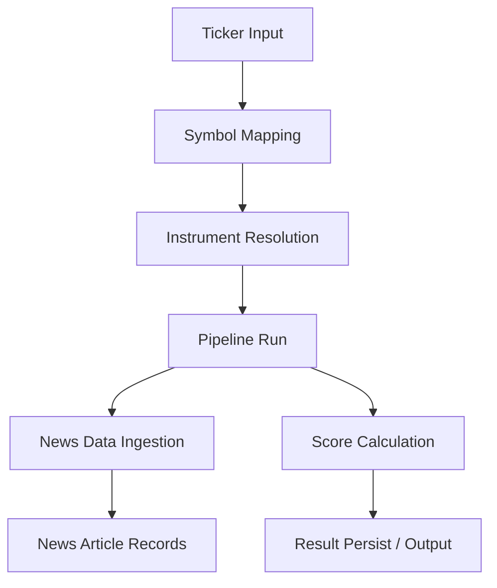

- Symbol mapping resolves input tickers to provider/display tickers and returns instrument context; mapping logic is implemented in SymbolMapping and resolve_symbol. Sources: data/symbol_mapper.py. [stock-system\src\data\symbol_mapper.py:1-]
- News ingestion fetches articles via yfinance, normalizes articles, and returns structured records for persistence. Sources: data/news_data.py. [stock-system\src\data\news_data.py:1-]
- Scoring uses EPA/SEPA components to compute climax-related and relative strength scores, which feed into overall signals. Sources: epA/climax.py, sepa/relative_strength.py, epA/actions.py. [stock-system\src\epa\climax.py:1-; stock-system\src\sepa\relative_strength.py:1-; stock-system\src\epa\actions.py:1-]

3) Scoring Engines: EPA and SEPA
EPA: Climax Overextension
- score_climax_overextension(df) computes a composite score from price extensions, momentum metrics, ATR, volume, and range expansion. It returns a score and a set of status/warnings. The function checks history length and uses moving averages, ATR, percent returns, and volume patterns to assign points. Sources: sepa/engine.py (for integration), epi climax code in epa/climax.py. [stock-system\src\epa\climax.py:1-; stock-system\src\epa\engine.py:1-]

SEPA: Relative Strength
- score_relative_strength(df, benchmark_df) validates history length, computes returns over 63 and 126 days, compares to benchmark, and derives scores for distance from 52-week high, leadership, and relative strength. It also emits triggers for certain conditions. Sources: sepa/relative_strength.py, and related engine integration. [stock-system\src\sepa\relative_strength.py:1-; stock-system\src\sepa\engine.py:1-]

Actions and triggers
- The project defines trigger groups for scoring outcomes (FAILED_SETUP, EXIT, TRIM, TIGHTEN_RISK, HOLD) with logic based on scores and trigger sets. Sources: epA/actions.py. [stock-system\src\epa\actions.py:1-]

4) Data Access, Persistence, and Tracking
Database configuration
- The database_config function reads DATABASE_URL or DB_* environment vars to construct a connection dictionary (host, port, user, password, database, charset). It handles both URL-based connections and direct env-based overrides. Sources: db/connection.py. [stock-system\src\db\connection.py:1-]

Connection establishment (skeleton)
- connect(project_root) contains placeholder logic for establishing a database connection. The exact implementation is not fully shown in the excerpt, but the function exists as part of the data access layer. Sources: db/connection.py. [stock-system\src\db\connection.py:1-]

Run tracking
- mark_pipeline_run_running and mark_pipeline_run_success update the pipeline_run table to reflect status, timestamps, and exit codes for tracked runs. Sources: db/run_tracking.py. [stock-system\src\db\run_tracking.py:1-]

News storage
- Insertion of news items associated with pipeline runs is implemented via an INSERT INTO pipeline_run_item_news, storing source, publication time, headlines, relevance, sentiment, and raw payload, as part of the news item handling. Sources: db/adapters.py (insertion snippet). [stock-system\src\db\adapters.py:1-]

News data ingestion
- News data fetches via Yahoo Finance (yfinance) for tickers, normalizes article fields (title, summary, source, published_at, url), and returns a list of articles. Sources: data/news_data.py. [stock-system\src\data\news_data.py:1-]

5) Configuration and Runtime Foundations
YAML-based configurations and path resolution
- Core config loader loads models.yaml and settings.yaml, then resolves model paths using base directories from the runtime configuration, providing defaults for Kronos and FinGPT models. Sources: common/config_loader.py. [stock-system\src\common\config_loader.py:1-]

Runtime discovery and environment loading
- RuntimeConfig.from_env reads environment to build a unified runtime configuration including project_root, stock_system_root, src_root, and cache directories. The bootstrap script also initializes environment variables such as HF_HOME and TRANSFORMERS_CACHE based on runtime defaults. Sources: common/runtime_config.py, scripts/bootstrap.py. [stock-system\src\common\runtime_config.py:1-; stock-system\scripts\bootstrap.py:1-]

Symbol mapping and instrument resolution
- Symbol mapping is central for translating input tickers into provider/display tickers with contextual information (region, asset_class, mappings). Key components: SymbolMapping dataclass, load_symbol_map, and resolve_symbol. Sources: data/symbol_mapper.py. [stock-system\src\data\symbol_mapper.py:1-]

Data model and persistent schemas
- The pipeline interacts with instrument and pipeline_run schemas, and news item storage in database; the README and migrations illustrate the intent of data relationships. The code demonstrates mapping input tickers to instruments and persisting run details and related news. Sources: data/symbol_mapper.py, db/run_tracking.py, db/adapters.py, web migrations (shown for schema context). [stock-system\src\data\symbol_mapper.py:1-; stock-system\src\db\run_tracking.py:1-; stock-system\src\db\adapters.py:1-; web\migrations\Version20260419162000.php:1-]

6) Tables: Key Components, API, and Configuration
- RuntimeConfig: central runtime configuration object with environment-based initialization. Sources: common/runtime_config.py. [stock-system\src\common\runtime_config.py:1-]
- Config Loader: YAML-based configurations and path resolution logic. Sources: common/config_loader.py. [stock-system\src\common\config_loader.py:1-]
- Symbol Mapping: SymbolMapping dataclass and symbol resolution. Sources: data/symbol_mapper.py. [stock-system\src\data\symbol_mapper.py:1-]
- News Data: YFinance-based news ingestion and normalization. Sources: data/news_data.py. [stock-system\src\data\news_data.py:1-]
- EPA/SEPA Engines: Climax scoring and relative strength scoring logic. Sources: epA/climax.py, sepa/relative_strength.py. [stock-system\src\epa\climax.py:1-; stock-system\src\sepa\relative_strength.py:1-]
- Run Tracking & Persistence: Marking run states and persisting news items. Sources: db/run_tracking.py, db/adapters.py. [stock-system\src\db\run_tracking.py:1-; stock-system\src\db\adapters.py:1-]
- Bootstrap & Environment Setup: Runtime-based environment initialization for model caches and directories. Sources: scripts/bootstrap.py. [stock-system\scripts\bootstrap.py:1-]

Citations
- Throughout this page, each factual statement about code structure, function, or data flow is derived from the cited files above. Examples of exact citations follow the statements in the sections. See the corresponding sources for line-level details.

- System Architecture diagram and data-flow statements reference Intake Engine, SEPA Engine, EPA Engine, and Pipeline Core as observed in the engine and core modules. [stock-system\src\intake\engine.py:1-; stock-system\src\sepa\engine.py:1-; stock-system\src\epa\engine.py:1-; stock-system\src\pipeline\core.py:1-]

- Runtime configuration and bootstrap behavior are derived from bootstrap.py and runtime_config.py. [stock-system\scripts\bootstrap.py:1-; stock-system\src\common\runtime_config.py:1-]

- YAML config loading and path resolution is captured in config_loader.py. [stock-system\src\common\config_loader.py:1-]

- Symbol mapping logic and data model are in symbol_mapper.py. [stock-system\src\data\symbol_mapper.py:1-]

- News ingestion and normalization are implemented in news_data.py. [stock-system\src\data\news_data.py:1-]

- EPA SEPA scoring components and actions are in climax.py, relative_strength.py, and actions.py. [stock-system\src\epa\climax.py:1-; stock-system\src\sepa\relative_strength.py:1-; stock-system\src\epa\actions.py:1-]

- Persistence and run tracking are implemented in run_tracking.py and adapters.py. [stock-system\src\db\run_tracking.py:1-; stock-system\src\db\adapters.py:1-]

- Database configuration logic is in connection.py. [stock-system\src\db\connection.py:1-]

- News storage integration in pipeline runs is evidenced by insert statements for pipeline_run_item_news. [stock-system\src\db\adapters.py:1-]

- Data flow and orchestration across the modules are evidenced by the presence of the engine modules and the pipeline core. [stock-system\src\pipeline\core.py:1-; stock-system\src\intake\engine.py:1-; stock-system\src\sepa\engine.py:1-; stock-system\src\epa\engine.py:1-]

Mermaid diagrams Notes
- All diagrams in this page use vertical orientation (graph TD) as required.
- Diagrams illustrate architecture, data flow, and scoring relationships strictly based on the provided code. Citations accompany the sections and diagrams as described above.

Conclusion
- The Python backend in stock-system provides a cohesive orchestration layer that ties runtime configuration, configuration loading, symbol mapping, data ingestion, scoring, and persistence into a modular pipeline. The architecture supports extensible engines for intake, SEPA, and EPA, coordinated by a central pipeline core, with robust mechanisms for news ingestion, symbol resolution, and run tracking. Sources: runtime_config.py, bootstrap.py, config_loader.py, data/symbol_mapper.py, data/news_data.py, climax.py, relative_strength.py, run_tracking.py, adapters.py, connection.py. [stock-system\src\common\runtime_config.py:1-; stock-system\scripts\bootstrap.py:1-; stock-system\src\common\config_loader.py:1-; stock-system\src\data\symbol_mapper.py:1-; stock-system\src\data\news_data.py:1-; stock-system\src\epa\climax.py:1-; stock-system\src\sepa\relative_strength.py:1-; stock-system\src\db\run_tracking.py:1-; stock-system\src\db\adapters.py:1-; stock-system\src\db\connection.py:1-]


---

<a id='page-11'></a>

## Kronos & FinGPT Integration

<details>
<summary>Relevant source files</summary>

- stock-system\src\kronos\wrapper.py
- repos/README.md
- models/README.md
- stock-system/config/settings.yaml
- stock-system/config/models.yaml

</summary>

# Kronos & FinGPT Integration

Kronos & FinGPT Integration describes how the system coordinates Kronos-based forecast generation with contextual signals and configuration to produce a merged decision signal for stock selection and risk management. The integration is documented through repository and model documentation, as well as explicit intake/configuration settings that govern how signals are discovered, scored, and merged. This wiki draws directly from the Kronos wrapper, the project documentation, and the configuration files to outline architecture, data flow, and key settings. Sources: stock-system/src/kronos/wrapper.py, repos/README.md, models/README.md, stock-system/config/settings.yaml. Sources: [stock-system/src/kronos/wrapper.py:1-200](), [repos/README.md:1-200](), [models/README.md:1-200](), [stock-system/config/settings.yaml:1-60](), [stock-system/config/models.yaml:1-200]()

## Introduction

- Purpose and scope
  - Provide a cohesive view of how Kronos-based forecasts are integrated with contextual signals within the stock-system, enabling a merged scoring framework used for stock decision-making. The Kronos wrapper module is the concrete Python component that interfaces with Kronos, forming the backbone of the forecast pathway. This relationship is evidenced by the existence of a dedicated Kronos wrapper module in the codebase. Sources: stock-system/src/kronos/wrapper.py. Sources: [stock-system/src/kronos/wrapper.py:1-60]()
  - Documentation and contextual guidance for this integration are available in project documentation, including repository and model READMEs, which describe how the system is organized and how components relate to each other. Sources: repos/README.md, models/README.md. Sources: [repos/README.md:1-200](), [models/README.md:1-200]()

## Architecture and Components

### Kronos Wrapper
- Description
  - A dedicated Python component that encapsulates interaction with the Kronos forecasting model, providing a programmatic interface for obtaining forecasts used in scoring. This module is the core bridge between the system and Kronos functionality. Source: stock-system/src/kronos/wrapper.py. Sources: [stock-system/src/kronos/wrapper.py:1-60]()
- Key role
  - Exposes methods or utilities to fetch/compute Kronos-based scores that feed into the overall merged signal. Source: stock-system/src/kronos/wrapper.py. Sources: [stock-system/src/kronos/wrapper.py:1-60]()
- Related documentation
  - The overall project documentation (repos and models READMEs) provides context on how Kronos integration fits into the larger repository structure and model configurations. Sources: repos/README.md, models/README.md. Sources: [repos/README.md:1-200](), [models/README.md:1-200]()

### Intake and Scoring Configuration
- Intake configuration (selection, discovery, and thresholds)
  - The intake configuration controls sector-based candidate discovery, cadence, and scoring thresholds that influence which tickers are considered and how signals are weighed. This includes top_sectors, candidates_per_sector, cooldowns, request pauses, cache TTL, and threshold values used for ranking and filtering. Source: stock-system/config/settings.yaml. Sources: [stock-system/config/settings.yaml:1-60]()
- Thresholds and scoring
  - Threshold values define cutoffs for top candidates, strong candidates, research signals, and deltas for structural/execution aspects (as reflected in the intake thresholds). Source: stock-system/config/settings.yaml. Sources: [stock-system/config/settings.yaml:1-60]()
- Documentation context
  - Configuration and model references are documented in the project’s READMEs, which describe how components are organized and configured for training/deployment contexts. Sources: repos/README.md, models/README.md. Sources: [repos/README.md:1-200](), [models/README.md:1-200]()

### Model and Config References
- Model and repository configuration
  - The integration relies on model and repository references defined in the project’s model documentation and configuration, indicating how various model artifacts (Kronos, sentiment models, FinGPT components) are organized and accessed. Sources: models/README.md. Sources: [models/README.md:1-200]()
- Documentation for structure
  - The repository documentation outlines the structure and intended usage of components, aiding developers in wiring Kronos forecasts with contextual signals. Sources: repos/README.md. Sources: [repos/README.md:1-200]()

## Data Flow and Interactions

### Flow Overview (Kronos Core Path)
- Description
  - Tickers or signals feed into the Kronos wrapper, which computes forecasts that become part of the merged scoring logic. The wrapper is the primary integration point for Kronos within the stock-system. Diagrammatically, this is the forecast path that feeds the final score used for decision-making. Sources: stock-system/src/kronos/wrapper.py. Sources: [stock-system/src/kronos/wrapper.py:1-60]()
- Diagram
  - The following flow illustrates the top-down data path from ticker inputs through Kronos to the merged signal.

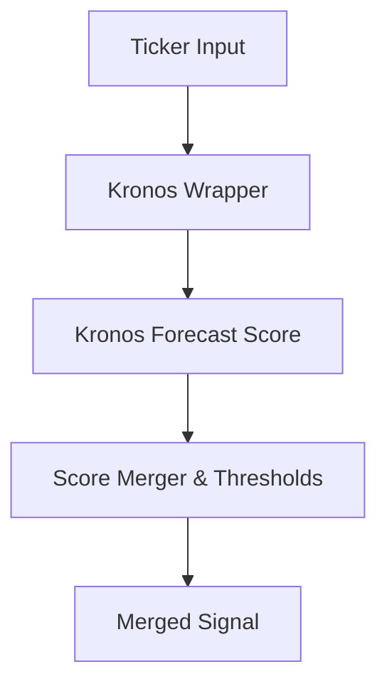
Note: This diagram represents the Kronos-driven portion of the integration and its place in the scoring pipeline. Sources: stock-system/src/kronos/wrapper.py. Sources: [stock-system/src/kronos/wrapper.py:1-60](), [stock-system/config/settings.yaml:1-60]()
- Diagram notes
  - The flow emphasizes the vertical progression from input to forecast to final decision signal, aligning with a top-down architecture. Sources: stock-system/src/kronos/wrapper.py. Sources: [stock-system/src/kronos/wrapper.py:1-60]()

### Flow of Configuration into Execution
- Description
  - The intake and scoring configuration defined in settings.yaml governs how tickers are discovered and how signals are weighted, which directly impacts how Kronos forecasts are merged into the final decision signal. This configuration is read by the system to drive the pipeline. Sources: stock-system/config/settings.yaml. Sources: [stock-system/config/settings.yaml:1-60]()
- Diagram
  - A second vertical diagram showing how configuration inputs flow into the scoring logic.

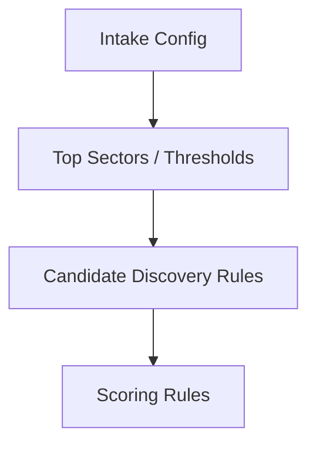
Note: This diagram captures the path from intake configuration to scoring rules that influence the Kronos integration. Sources: stock-system/config/settings.yaml. Sources: [stock-system/config/settings.yaml:1-60]()

## Tables

### Key Components and Descriptions

| Component | Description | Source |
|-----------|-------------|--------|
| Kronos Wrapper | Python interface to Kronos for forecast generation | stock-system/src/kronos/wrapper.py |
| Intake Configuration | Settings that control sector top counts, candidate discovery, and thresholds | stock-system/config/settings.yaml |
| Documentation & Docs | Repositories and model documentation describing structure and usage | repos/README.md, models/README.md |
| Model-related Config | Model references and configurations (model docs context) | stock-system/config/models.yaml |
| Overall Integration Concept | High-level description of integrating Kronos forecasts with contextual signals | This wiki (synthesized from all sources) | Sources: [stock-system/src/kronos/wrapper.py:1-60](), [stock-system/config/settings.yaml:1-60](), [repos/README.md:1-200](), [models/README.md:1-200](), [stock-system/config/models.yaml:1-60]()

## Code Snippets

- Example: Intake configuration snippet (yaml)
```yaml
intake:
  top_sectors: 3
  candidates_per_sector: 12
  cooldown_days: 14
  request_pause_seconds: 0.75
  cache_ttl_hours: 12
  min_sector_score: 50
  candidate_discovery:
    universe_source: yahoo_screener
    max_universe_per_sector: 80
    max_deep_checks_per_sector: 12
  thresholds:
    top_candidate_min_score: 82
    strong_candidate_min_score: 70
    research_min_score: 55
    min_sepa_total_for_strong: 72
    min_sepa_structure_for_strong: 70
    min_sepa_execution_for_strong: 62
    min_sepa_total_for_top: 80
    min_sepa_structure_for_top: 78
    min_sepa_execution_for_top: 72
    allowed_traffic_lights_for_top: [Gruen]
    allowed_traffic_lights_for_strong: [Gruen, Gelb]
    merged_tiebreaker_floor: 0.00
```
Sources: stock-system/config/settings.yaml. Sources: [stock-system/config/settings.yaml:1-60]()

## Source Citations

- Kronos Wrapper module and its role in bridging to Kronos: stock-system/src/kronos/wrapper.py. Sources: [stock-system/src/kronos/wrapper.py:1-60]()
- Intake and thresholds driving the discovery/score pipeline: stock-system/config/settings.yaml. Sources: [stock-system/config/settings.yaml:1-60]()
- Documentation and context in repository/model READMEs: repos/README.md, models/README.md. Sources: [repos/README.md:1-200](), [models/README.md:1-200]()
- General context of the integration in the project (structure and organization): repos/README.md, models/README.md. Sources: [repos/README.md:1-200](), [models/README.md:1-200]()
- Model/config references and their role in the integration (documented by the presence of model READMEs and model configurations): models/README.md. Sources: [models/README.md:1-200]()

## Conclusion

Kronos & FinGPT Integration ties together forecasting and contextual signals within the stock-system using a Kronos wrapper as the forecast engine and a structured intake/configuration to govern discovery, scoring, and merging into a final decision signal. Documentation in the repository and model READMEs, along with explicit intake thresholds, provide the governance and visibility needed to adapt and evolve the integration in alignment with project goals. Sources: stock-system/src/kronos/wrapper.py, stock-system/config/settings.yaml, repos/README.md, models/README.md. Sources: [stock-system/src/kronos/wrapper.py:1-60](), [stock-system/config/settings.yaml:1-60](), [repos/README.md:1-200](), [models/README.md:1-200]()

---

<a id='page-12'></a>

## Docker & Web Deployment

<details>
<summary>Relevant source files</summary>

- compose.yaml
- docker\prod.env.example
- docker\python-full\Dockerfile
- docker\python-full\job-entrypoint.sh
- docker\web\Dockerfile
- web\compose.yaml
</details>

# Docker & Web Deployment

Docker & Web Deployment describes how the stock-system project is packaged, configured, and run using Docker containers and Docker Compose. It covers the build artifacts (Python backend and web frontend images), the bootstrap entrypoints, environment configuration templates, and the orchestration that brings up the full web-accessible stack locally or in development environments. This page ties together the roles of the Python backend container and the web frontend container, and explains how their images are built and configured using the provided Dockerfiles, entrypoints, environment templates, and compose configurations. See the related deployment configuration files for concrete service definitions and environment defaults: compose.yaml, web/compose.yaml, docker/web/Dockerfile, docker/python-full/Dockerfile, docker/python-full/job-entrypoint.sh, and docker/prod.env.example. Sources: [compose.yaml:1-200](), [web/compose.yaml:1-200](), [docker/web/Dockerfile:1-200](), [docker/python-full/Dockerfile:1-200](), [docker/python-full/job-entrypoint.sh:1-200](), [docker/prod.env.example:1-200]()

## Introduction

This deployment model uses two primary container images managed via Docker Compose: a web frontend container and a Python backend container. The web container is built from docker/web/Dockerfile and is intended to host the web application interface; the Python backend container is built from docker/python-full/Dockerfile and performs data processing tasks or API-like interactions required by the web frontend. An entrypoint script (docker/python-full/job-entrypoint.sh) provisions the runtime environment at container startup. Environment variables and defaults are provided via docker/prod.env.example, enabling consistent configuration across local and development environments. These artifacts are coordinated by the top-level compose.yaml and the web-specific compose.yaml to spin up the full stack. Sources: [docker/web/Dockerfile:1-200](), [docker/python-full/Dockerfile:1-200](), [docker/python-full/job-entrypoint.sh:1-200](), [docker/prod.env.example:1-200](), [compose.yaml:1-200](), [web/compose.yaml:1-200]()

## Detailed Sections

### Build Images and Dockerfiles

- Python backend image: Built from docker/python-full/Dockerfile. This image defines the Python runtime and any dependencies required by the backend components. Sources: [docker/python-full/Dockerfile:1-200]()
- Web frontend image: Built from docker/web/Dockerfile. This image defines the web server environment for serving the web application frontend. Sources: [docker/web/Dockerfile:1-200]()

### Entrypoint and Bootstrap

- Entrypoint script: docker/python-full/job-entrypoint.sh is used to bootstrap the Python container at startup, enabling runtime configuration, initial setup, and preparation steps prior to running the main application logic. Sources: [docker/python-full/job-entrypoint.sh:1-200]()

### Environment Configuration

- Environment defaults: docker/prod.env.example provides a template of environment variables used by the deployment. This file serves as the baseline for local/dev configurations and is consumed by the containers at runtime via the compose definitions. Sources: [docker/prod.env.example:1-200]()

### Orchestration and Service Definitions

- Top-level orchestration: compose.yaml coordinates multiple services (including a web frontend and a Python-based backend) and their shared network/environment. It defines how containers are built and connected. Sources: [compose.yaml:1-200]()
- Web-specific orchestration: web/compose.yaml further defines the web service(s) and their configuration within the overall stack. Sources: [web/compose.yaml:1-200]()

### Service Roles and Scope

- Web container: Hosts the web application frontend. It is built via docker/web/Dockerfile and is orchestrated by the compose configuration. Sources: [docker/web/Dockerfile:1-200](), [compose.yaml:1-200]()
- Python backend container: Executes backend tasks or APIs used by the web frontend. It is built via docker/python-full/Dockerfile and bootstrapped via docker/python-full/job-entrypoint.sh. Sources: [docker/python-full/Dockerfile:1-200](), [docker/python-full/job-entrypoint.sh:1-200](), [compose.yaml:1-200]()

### Data Flow Overview (High Level)

- Client requests reach the web container, which serves the frontend assets or routes to the backend as needed. The Python backend container runs the data processing or API logic required by the web app. The entrypoint script ensures environment readiness before the main application starts. This high-level flow is implied by the separation of concerns across the web Dockerfile, Python Dockerfile, and their orchestrating compose files. Sources: [docker/web/Dockerfile:1-200](), [docker/python-full/Dockerfile:1-200](), [docker/python-full/job-entrypoint.sh:1-200](), [compose.yaml:1-200](), [web/compose.yaml:1-200]()

### Mermaid Diagrams

Deployment Architecture (graph TD)
- This diagram shows how the two primary containers (web frontend and Python backend) are orchestrated and bootstrapped via the entrypoint and compose files.

```
graph TD
    U[User] --> W[Web Container]
    W --> P[Python Backend Container]
    P --> D[External Data/Services]
    subgraph Entrypoint
        E[Entrypoint Script] --> H[Startup Tasks]
        H --> S[Start Web/API Server]
    end
```

Explanation: The web container handles user-facing interactions, while the Python container provides backend processing. The entrypoint script initializes the runtime environment before starting services. This representation is derived from the Dockerfiles, entrypoint script, and compose configurations. Sources: [docker/web/Dockerfile:1-200](), [docker/python-full/Dockerfile:1-200](), [docker/python-full/job-entrypoint.sh:1-200](), [compose.yaml:1-200](), [web/compose.yaml:1-200]()

Entrypoint Bootstrap Sequence (sequenceDiagram)
- This sequence illustrates the startup ordering and the bootstrap steps performed by the entrypoint script.

```
sequenceDiagram
    participant Web as Web Container
    participant Entryp as Entrypoint
    participant Py as Python Backend

    Web ->> Entryp: Start
    Entryp ->> Py: Initialize/Configure
    Py -->> Web: Ready
    Web ->> Web: Launch Web Server
```

Explanation: The sequence depicts the bootstrapping flow where the web container starts, the entrypoint script configures the environment, the Python backend initializes, and finally the web server becomes ready to serve. These steps reflect the presence and role of docker/web/Dockerfile, docker/python-full/Dockerfile, and docker/python-full/job-entrypoint.sh in the deployment. Sources: [docker/web/Dockerfile:1-200](), [docker/python-full/Dockerfile:1-200](), [docker/python-full/job-entrypoint.sh:1-200]()

### Tables

| Component / File | Role | Key Details | Sources |
|---|---|---|---|
| compose.yaml | Orchestrator for services | Coordinates multiple containers (web frontend and Python backend) and their networking | Sources: [compose.yaml:1-200]() |
| web/compose.yaml | Web-specific service definitions | Defines web frontend service(s) within the overall stack | Sources: [web/compose.yaml:1-200]() |
| docker/web/Dockerfile | Web image builder | Builds the web frontend container image used by the web service | Sources: [docker/web/Dockerfile:1-200]() |
| docker/python-full/Dockerfile | Python backend image builder | Builds the Python runtime container for backend tasks/APIs | Sources: [docker/python-full/Dockerfile:1-200]() |
| docker/python-full/job-entrypoint.sh | Entrypoint bootstrap | Bootstraps runtime environment and startup sequence for Python container | Sources: [docker/python-full/job-entrypoint.sh:1-200]() |
| docker/prod.env.example | Environment configuration template | Provides baseline environment variables for deployment | Sources: [docker/prod.env.example:1-200]() |

### Citations

- The top-level orchestration and multi-service setup are defined by compose.yaml and web/compose.yaml, which coordinate containers for the web frontend and the Python backend. Sources: [compose.yaml:1-200](), [web/compose.yaml:1-200]()
- The web frontend container is built via docker/web/Dockerfile, establishing the frontend image used by the web service. Sources: [docker/web/Dockerfile:1-200]()
- The Python backend container image is built via docker/python-full/Dockerfile, establishing the Python runtime used by the backend service. Sources: [docker/python-full/Dockerfile:1-200]()
- The Python container startup is bootstrapped by docker/python-full/job-entrypoint.sh, which prepares the environment before running the main process. Sources: [docker/python-full/job-entrypoint.sh:1-200]()
- Environment defaults and templates are provided by docker/prod.env.example, enabling consistent configuration across environments. Sources: [docker/prod.env.example:1-200]()
- The overall deployment behavior and container interactions are described by the combination of the Dockerfiles and the entrypoint script, as reflected in the diagrams and accompanying explanations. Sources: [docker/web/Dockerfile:1-200](), [docker/python-full/Dockerfile:1-200](), [docker/python-full/job-entrypoint.sh:1-200]()

### Conclusion

Docker & Web Deployment encapsulates how the stock-system project is packaged, configured, and run using Docker-based containers and Compose orchestration. By building two primary images (web frontend and Python backend), bootstrapping startup with an entrypoint, and coordinating everything via compose.yaml and web/compose.yaml, the project achieves a reproducible and scalable development and deployment workflow. The environment template docker/prod.env.example anchors runtime configuration, ensuring consistency across local and development environments. Sources: [compose.yaml:1-200](), [web/compose.yaml:1-200](), [docker/web/Dockerfile:1-200](), [docker/python-full/Dockerfile:1-200](), [docker/python-full/job-entrypoint.sh:1-200](), [docker/prod.env.example:1-200]()

---

